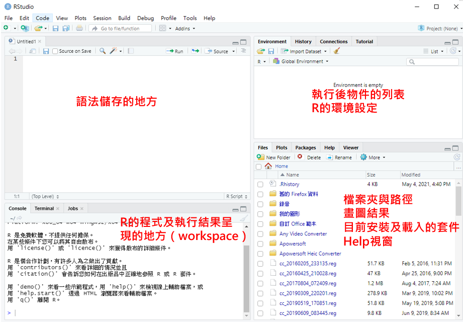

# 基礎篇_R 與R studio的介紹

## 什麼是R 和 Rstudio

R是一套開放式的統計**程式語言**，主要用於資料分析與統計運算，同時也具有強大的繪圖功能，R語言不僅是統計專業人員的研究工具，也是資料科學家經常使用的重要工具之一，使用者可以**免費**的下載並安裝在任何的作業系統上。

R studio是一套提供R整合開發環境的軟體(Integrated Development Environment; IDE）。

## 下載R 和 Rstudio

先裝R，再裝R studio Install R:

-   Windows: <https://cran.r-project.org/bin/windows/base/>
-   Mac: <https://cran.r-project.org/bin/macosx/>

Install RStudio Desktop:

-   <https://www.rstudio.com/products/rstudio/download/#download>

## Rstudio介面與初步設定

### Rstudio介面



### Rstudio初步設定

-   Tools \> Global Options 
    -   Code: Display 下勾選Show whitespace characters。 (coding時更清楚前面空格狀況) 
    -   Appearance: 可改變RStudio Theme. (可以改成深色模式讓眼睛休息一下) 

### 新建R Script


R Script(.R file)是純粹執行R的語法\
另外還有R Markdown or R Notebook (.Rmd file)，是用markdown方式呈現將文字、程式、表格與圖都編輯在同一份文件之中(在此不多做介紹)

### 新建R project

 

若想要執行的是一個計劃或同一個工作，可能會想將檔案或資料集中在同一個地方，這時可以新建一個New Project的資料夾，將東西統一存放

New Project -\> New Directory -\> New Project -\> 設定Project Name 和放檔案的路徑與資料夾

### 小技巧


可以在上述地方察看快捷鍵的指令， 也有一些常用的[快捷鍵整理](https://medium.com/rolandohsu/r%E7%9A%84%E5%AD%B8%E7%BF%92%E6%97%A5%E5%B8%B8-1-%E5%BF%AB%E6%8D%B7%E9%8D%B5-3b31de69e016)提供參考

另外比較重要的是R的註解標籤是**\#**

## 簡介R套件

R語言有很多的套件，這些套件可以簡單理解為「特定目的的函式、文件、資料之集合」([參考](https://2formosa.blogspot.com/2019/01/Introduction-to-R-packages.html))\
這些套件有些是下載完就內建的，有些是需要外部安裝的，而R語言的強大之處也建立在這些套件上

### 安裝套件

安裝套件：安裝只需要做一次，就是將你要的套件從網路上抓下來並安裝到你的電腦裡

若是外部的套件，第一次使用時需要先「安裝」\
例如，我們想要裝haven這個套件。

```{r eval=FALSE}
# 安裝套件：
install.packages("haven")
```

安裝完成後，右邊packages就會跟著出現\


### 載入套件

載入套件：確定要用的套件已經在電腦中後，在使用前，需要將該套件載入至R才能夠使用

但是安裝不等於載入，在每次開啟R檔案時，若需要使用套件中的函數，必須先載入後才能夠使用

```{r eval=FALSE}
# 載入套件：
library(haven)
## or
require(haven)
```

也可以用勾選的方式\


### 刪除套件

當我們可能裝錯套件時，也可以直接刪除特定套件

```{r eval=FALSE}
remove.packages("haven")
```

或著直接按旁邊的X\


### 更新套件

另外R語言中的套件時常進行更新，我們可以一次檢查那些需要更新


接著就可以點選進行特定套件的更新

或著也可以使用函數更新

```{r eval=FALSE}
# 更新所有套件
update.packages()

# 更新特定套件如haven
install.packages("haven")
```

### 輔助文件與help

至於套件或著裡面函數的詳細用法，我們可以用「**help**」來看這個套件的語法該如何設定

R語言當中有蠻完整的「查詢文件」可以查看

```{r eval=FALSE}
# 載入套件：
library(haven)

# 查詢套件/函數用法
help(haven) ## 查詢套件
help(read_dta) ## 查詢函數

## or
?haven
?read_dta
## or 在想查詢的套件/函數上面按F1
```

### 安裝講義所用套件

可以一次安裝多個套件，以下為本講義會使用的套件

```{r eval=FALSE}
# 接下來會用到的套件
pkgs <- c("haven", "lubridate", "magrittr",  "readr", "writexl", "devtools",
          "dplyr", "tidyverse", "data.table", "DescTools", "sjmisc", 
          "sjlabelled", "validate", "skimr")

# 一次安裝套件：
install.packages("pkgs")
```

另外以下是本講義使用的R語言環境

```{r}
devtools::session_info()
```

## 錯誤訊息

通常一開始學習很容易碰到執行程式時出現錯誤訊息，此時最快速的解決方法就是將遇到的錯誤訊息，「複製貼上」到google去搜尋，通常可以快速尋找到解決方案。

常見的錯誤訊息如下[(參考)](https://yijutseng.github.io/DataScienceRBook/intro.html#%E9%8C%AF%E8%AA%A4%E8%A8%8A%E6%81%AF):

-   Message：有可能的錯誤通知，程式會繼續執行
-   Warning：有錯誤，但是不會影響太多，程式會繼續執行
-   Error：有錯，而且無法繼續執行程式
-   Condition：可能會發生的情況
