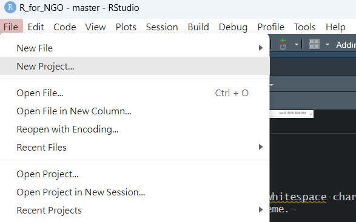
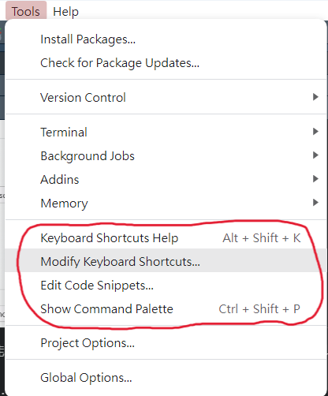

# 基礎篇_R 與R studio的介紹

## 什麼是R 和 Rstudio

R是一套開放式的統計程式語言，主要用於資料分析與統計運算，使用者可以免費的下載並安裝在任何的作業系統上。

R studio是一套提供R整合開發環境的軟體(Integrated Development Environment; IDE）。

## 下載R 和 Rstudio

先裝R，再裝R studio Install R:

-   Windows: <https://cran.r-project.org/bin/windows/base/>
-   Mac: <https://cran.r-project.org/bin/macosx/>

Install RStudio Desktop:

-   <https://www.rstudio.com/products/rstudio/download/#download>

## Rstudio介面與初步設定

### Rstudio介面


### Rstudio初步設定

-   Tools \> Global Options
    -   Code: Display tab下勾選Show whitespace characters。
    -   Appearance: 可改變RStudio Theme.

### 新建R Script


R Script(.R file)是純粹執行R的語法\
另外還有R Markdown or R Notebook (.Rmd file)，是用markdown方式呈現將文字、程式、表格與圖都編輯在同一份文件之中(在此不多做介紹)

### 新建R project

  若想要執行的是一個計劃或同一個工作，可能會想將檔案或資料集中在同一個地方，這時可以新建一個New Project的資料夾，將東西統一存放

New Project -\> New Directory -\> New Project -\> 設定Project Name 和放檔案的路徑與資料夾

### 小技巧



可以在上述地方察看快捷鍵的指令， 也有一些常用的[快捷鍵整理](https://medium.com/rolandohsu/r%E7%9A%84%E5%AD%B8%E7%BF%92%E6%97%A5%E5%B8%B8-1-%E5%BF%AB%E6%8D%B7%E9%8D%B5-3b31de69e016)提供參考

另外比較重要的是R的註解標籤是**\#**

## 安裝套件和help

安裝套件：安裝只需要做一次，就是將你要的套件從網路上抓下來並安裝到你的電腦裡\
載入套件：確定要用的套件已經在電腦中後，在使用前，需要將該套件載入至R才能夠使用

例如，\
我們想要裝haven這個套件。\
等R跑完安裝後，就可將這個套件載入。必須載入後才能夠使用這個套件\
這個套件可以讓我們將SPSS, SAS, STATA等資料檔讀入R之中。\
至於詳細的用法，我們可以用「**help**」來看這個套件的語法該如何設定

```{r eval=FALSE}
#安裝套件：
install.packages("haven")

#載入套件：
library(haven)
#or
require(haven)

#查詢套件/函數用法
help(haven) # 查詢套件
help(read_dta) # 查詢函數
#or
?haven
?read_dta
#or 在想查詢的套件/函數上面按F1
```

### 安裝講義所用套件

writexl\

## 錯誤訊息

在按鍵或執行程式時可能會遇到一些錯誤訊息，

常見的錯誤訊息如下[(參考)](https://yijutseng.github.io/DataScienceRBook/intro.html#%E9%8C%AF%E8%AA%A4%E8%A8%8A%E6%81%AF):

-   Message：有可能的錯誤通知，程式會繼續執行
-   Warning：有錯誤，但是不會影響太多，程式會繼續執行
-   Error：有錯，而且無法繼續執行程式
-   Condition：可能會發生的情況
