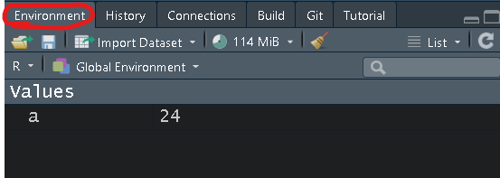

# 基礎篇_R語言的基礎概念

## 指派與命名

-   指派（assignment）：將資料儲存至一個代號（變項）內。\
    可以用"\<-" 或"="。但使用"\<-"好過"="\
    「\<-」的 Windows快捷鍵: 「**Alt+-**」\
    (另外也可以換個方向指派"-\>"，但較少使用)

```{r eval=FALSE}
# 將24存在「a」這個代號當中
a <- 24 
a = 24
24 -> a

# 將a-10存在「b」這個代號當中(a 需要先被指派)
b <- a-10
## or
a-10 -> b

# 若a已經代表24，那麼b就會等於24-10=14
b
```

若有指派a，則旁邊Environment -\> Global Environment -\> Values 就會出現a 

-   有效的命名

    -   以字母(大小寫都可)、數字、逗點(.)、下底線(\_)開頭
    -   若以.點開頭，後面不能接數字

-   常見命名規則

    -   以英文字母開頭(常見多以小寫字母開頭)

    ```{r eval=FALSE}
    #常見命名
    incomeLevel <- c("low", "middle", "high")
    income_level <- c("low", "middle", "high")
    ```

## 基本運算

### 數學基本運算

```{r eval=FALSE}
num1 <- 1
num2 <- 10

# 加 + 
num1+num2 ## 1+10 = 11

# 減 - 
num1-num2 ## 1-10 = -9

# 乘 * 
num1*num2 ## 1*10 = 10

# 除 / 
num1/num2 ## 1/10 = 0.1

# 餘數 %% 
10%%3 ## 10除以3後所得餘數

# 次方 ^ 
10^2 ## 10的2次方 = 100
```

### 邏輯運算

```{r eval=FALSE}
num1 <- 1
num2 <- 10

# 大於 > 
num1 > num2 ## num1是否大於num2 -> FALSE

# 小於 <
num1 < num2 ## num1是否小於num2 -> TRUE

# 等於 ==，為了不與變數設定混淆，判斷兩變數是否相等，要用雙等號
num1 == num2 ## num1是否等於num2 -> FALSE

# 大於等於 >=
num1 >= num2 ## num1是否大於等於num2 -> FALSE

# 小於等於 <=
num1 <= num2 ## num1是否小於等於num2 -> TRUE

# 且 &
TRUE & TRUE ## TRUE
TRUE & FALSE ## FALSE

# 或 |
TRUE | TRUE ## TRUE
TRUE | FALSE ## TRUE

# 反向布林變數! 
!TRUE ## 不等於TRUE 所以是 FALSE
```

## 資料型態

### 數字(numeric):

數值包括整數integer（沒有小數點）與浮點數double（有小數點）的數值

```{r eval=FALSE}
5L # integer
3.14 # double 
3 # double
```

### 字串(character):

用雙引號"框起的文字會被儲存為字串格式，若在數字前後加上雙引號，數字也會被儲存為文字形式，無法進行數值的加減乘除等運算。

```{r eval=FALSE}
"Apple"
'Friday'
```

### 邏輯(logical):

```{r eval=FALSE}
TRUE
FALSE
T
F
```

### 日期(date):

使用 lubridate 套件可更好呈現

```{r eval=FALSE}
library(lubridate)
ymd('2012/3/3')
```

## 資料結構

### 向量(vectors):

單維的資料，單一類型\
concatenate(堆疊): 以c(...)將「**相同類型**」值以「逗點」分隔而形成的向量

```{r eval=FALSE}
# 同樣是數字
c(1, 2 ,3)

c(c(1, 2), c(3, 4)) ## 等於c(1, 2, 3, 4)

# 同樣是文字
c("apple", "banana")

# 若文字中混數字會被自動當作文字
c("apple", "banana", 5) ## 等於c("apple, banana", "5") 
```

### 因子(factor):

因子是由向量轉換而成，多用於表示「**類別數據**｣

例如有三種收入等級的類別，分別是低收入、中等收入、高收入， 使用方法為factor(資料向量,levels=類別次序)，levels參數可設定各類別的次序

```{r eval=FALSE}
# 原本是文字資料，設定類別
fac_1 <- factor(c("低收入", "中等收入", "高收入", "低收入"),
                levels = c("低收入", "中等收入", "高收入"))
table(fac_1) ##查看次數分配

# 原本是數字資料，設定類別
fac_2 <- factor(c(1, 2, 3, 1, 3),
                levels = c(1, 2, 3), 
                labels = c("低收入", "中等收入", "高收入")) 
table(fac_2) ##查看次數分配

# 若是資料多了一個4沒有被設定類別 -> 被當成缺失值
fac_3 <- factor(c(1, 2, 3, 1, 3, 4),
                levels = c(1, 2, 3),
                labels = c("低收入", "中等收入", "高收入")) 
table(fac_3) ##查看次數分配
```

### 清單(list):

可以包含向量、矩陣、不同的清單，可以包含「**不同的資料類型**」。\
通常統計跑完後，結果會儲存在清單之中

```{r eval=FALSE}
num_list <- c(3, 4, 5)
char_list <- c("a", "b")
logic_list <- c(TRUE, TRUE, FALSE)
out_list_1 <- list(num_list, char_list, logic_list, 3)

## or 
out_list_3 <- list(
  c(3, 4, 5),
  c("a", "b"),
  c(TRUE, TRUE, FALSE),
  3
)

## or 給予名稱
out_list_2 <- list(
  num_list = c(3, 4, 5),
  char_list = c("a", "b"),
  logic_list = c(TRUE, TRUE, FALSE),
  3
)
```

### 矩陣(matrices):

二維的資料，單一類型

```{r eval=FALSE}
mat_1 <- matrix(1:4, nrow = 2, ncol = 2)
mat_2 <- matrix(1:9, nrow = 3, ncol = 3)
```

### 陣列(array):

多維度的資料，單一類型

```{r eval=FALSE}
vec_1 <- c(1, 2, 4)
vec_2 <- c(15, 17, 27, 3, 10, 11)
output <- array(c(vec_1, vec_2), dim = c(3, 3, 2))
```

### 資料架構(data frame)：

像是我們用的套裝統計軟體（如excel, spss, stata）中資料儲存的方式。 每一欄（Column）儲存不同的資料、每一列（Row）代表不同的觀察值

```{r eval=FALSE}
num_list <- c(3, 4, 5)
char_list <- c("a", "b", "c")
logic_list <- c(TRUE, FALSE, TRUE)

# 使用data.frame()來創建新的資料框
data_frame <- data.frame(num_list, char_list, logic_list)

# 或是將list 轉成data.frame
data_list <- list(
  num_list, char_list, logic_list
)

data_list <- as.data.frame(data_list)
```

### 查詢資料型態或結構

-   Type: 是查看電腦如何儲存資料，物件的基本型態
-   Class: 是查看物件的類別(螢幕顯示的型態)，及能對它進行的操作所做的分類

```{r eval=FALSE}
# type
typeof(c("John", "Mary"))
typeof(c(2, 3.1412))
typeof(c(TRUE, TRUE, F))

# class
class(c("John", "Mary"))
class(c(2, 3.1412))
class(c(TRUE, TRUE, F))
```

### 轉換資料型態或結構

使用`as.targetClass`將值轉換為`targetClass`類。

-   `as.numeric()`將值轉換為數字類
-   `as.character()`將值轉換為字符類
-   其他轉換......

```{r eval=FALSE}
num_t1 <- c(0.1, 2 , 4)
char_t1 <- c("0.1", "2", "4")

as.character(num_t1)
as.numeric(char_t1)
```

## 簡單條件判斷式

### if-else敘述

-   邏輯判斷: if-else敘述 若if後所接邏輯判斷為真(TRUE)，就會執行if下方之程式碼，若為偽(FALSE)，則執行else下方之程式碼，若程式中沒有else片段，則不執行任何程式碼。

```{r eval=FALSE}
#舉例來說，若考試分數大於等於60分，則印出及格字樣，
#小於60分則印出不及格字樣，程式範例如下
score <- 59

if(score >= 60){
  print("及格")
}

if(score >= 60){
  print("及格")
}else{
  print("不及格")
}
```

-   多重邏輯判斷: if-else if-else

```{r eval=FALSE}
score <- 95

if(score >= 90){
  print("優秀")
}else if(score >= 60){
  print("及格")
}else{
  print("不及格")
}
```

-   邏輯判斷簡化: ifelse\
    ifelse()函數可用最短的方式取代if-else敘述，\
    使用方法為`ifelse(邏輯判斷, 判斷為真要執行的程式碼, 判斷為偽要執行的程式碼)`

```{r eval=FALSE}
score <- 80
ifelse(score >= 60, "及格", "不及格")

ifelse(score >= 90, "優秀",
       ifelse(score >= 60, "及格", "不及格"))
```

## pipe


