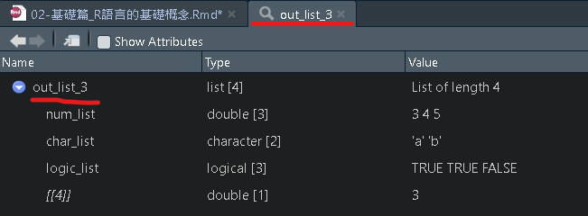

# 基礎篇_R語言的基礎概念

## 物件基礎操作

R語言是以**「物件導向」**為主的程式語言，可以簡單想成在R語言當中，每一個**東西**都可以視為一個物件(object)，或著可以暫時先將物件想像成「資料」，這樣的資料內容可以是由一個或多個文字、數字或其他形式所組成的。\

接著我們會介紹，在R語言當中可以根據創建出來的物件進行各種操作，像是指派、命名或數學運算，而物件也可能是由不同的結構所組成，也有可能會儲存成不同的形態。

### 指派（assignment）：

我們可以簡單的將指派理解為一種**「變項的設定」**，也就是將不管是一個或多個物件視為某一個**「變項的內容」**，而指派就是將這些物件(組合成的變項內容)指派(設定)一個**「變項(物件)名稱」**。

將資料儲存至一個代號（變項）內，可以用"\<-" 或"="，但使用"\<-"好過"="，另外也可以換個方向指派"-\>"，但通常由左至右較易閱讀因此較少使用。\
(「\<-」的 Windows快捷鍵: 「**Alt+-**」)

若我們沒有指派成為某個變項，那麼這個物件會直接的顯示在視窗 以下範例單獨顯示「24」

```{r}
24
```

若是我們有指派物件，那麼這個變項就會暫存在R語言的環境當中，可隨時拿來使用 以下範例將「24」作為一個物件，並指派為「a」(變項名稱)。

```{r}
# 將24存在「a」這個代號當中
a <- 24 
a = 24
24 -> a

# 輸出a為24
a
```


一個**已經**被指派(設定)的變項，也可以當作另一個變項的內容，\
以下範例將「a - 10」作為一個物件，並指派為「b」，而因為原先a是代表24，因此「b」就會是24-10 = 14。

```{r}
# 將a-10存在「b」這個代號當中(a 需要先被指派)
a <- 24 

b <- a - 10
## or
a - 10 -> b

# 輸出b:若a已經代表24，那麼b就會等於24-10=14
b
```

另外如果不同的物件都指派到相同的變項名稱，那**較後面**指派會取代較早指派的物件，\
以下範例先將「2」作為一個物件，並指派為「c」，再將「4」作為一個物件，並同樣指派為「c」，此時C所代表的是後面所指派的4。

```{r}
# 先將2存在「c」這個代號當中
c <- 2
# 輸出c為2
c

# 再將4同樣存在「c」這個代號當中
c <- 4
# 輸出c為4
c
```

### 查詢顯示物件與刪除物件

在我們已經指派了某個變項後，此時他會暫存R語言的環境當中， 在此我們先重新指派a、b、c(注意，相同變項名稱，後續指派會取代前面指派的)。

```{r}
a <- 24 
b <- a - 10
c <- 4
```


若是我們想要**查看/輸出**「a」當中的內容，可以直接打物件名稱或著用`print()函數`輸出。

```{r}
# 直接打物件名稱
a
# 用print()函數將物件內容輸出
print(a)
```

若是我們想要**移除**整個變項「a」，可以用`rm()函數`移除。

```{r}
# 用rm()函數移除物件
rm(a)
```


### 命名

上述的a、b、c都是我們自己給予的一個簡單的變項名稱，在R語言當中對於變項名稱也有需要遵守的**命名規則**，最需要注意的是在R語言當中英文字母的**大小寫**是有區分的，另外也針對開頭的強制規定。

-   有效的命名

    -   以字母(大小寫都可)、數字、逗點(.)、下底線(\_)**開頭**
    -   若以.點開頭，後面不能接數字

而實際在操作上，通常會有兩種常見的命名方式，若是英文單詞太長也可以進行適當縮寫

-   常見命名規則

    -   1.以小寫字母開頭的一個單詞(常見多以小寫字母開頭)
    -   2.若為兩個單詞組成，以小寫字母開頭的一個單詞，後面的單詞第一個字母大寫
    -   3.若為兩個單詞組成，以小寫字母開頭的一個單詞，後面接`_`，再接著第二個單詞且第一個字母小寫

```{r eval=FALSE}
# 1
income <- 50000
## 縮寫
inc <- 50000
# 2
incomeLevel <- c("low", "middle", "high")
# 3
income_level <- c("low", "middle", "high")
```

## 基本運算

以下介紹簡單的運算方式，另外還有很多其他函數可以做基礎或進階的數學換算或運算，若有需要使用到可自行查找

### 數學基本運算

```{r eval=FALSE}
num1 <- 1
num2 <- 10

# 加 + 
num1+num2 ## 1+10 = 11
# 減 - 
num1-num2 ## 1-10 = -9
# 乘 * 
num1*num2 ## 1*10 = 10
# 除 / 
num1/num2 ## 1/10 = 0.1
# 餘數 %% 
10%%3 ## 10除以3後所得餘數
# 次方 ^ 
10^2 ## 10的2次方 = 100
```

### 邏輯運算

```{r eval=FALSE}
num1 <- 1
num2 <- 10

# 大於 > 
num1 > num2 ## num1是否大於num2 -> FALSE
# 小於 <
num1 < num2 ## num1是否小於num2 -> TRUE
# 等於 ==，為了不與變數設定混淆，判斷兩變數是否相等，要用雙等號
num1 == num2 ## num1是否等於num2 -> FALSE
# 大於等於 >=
num1 >= num2 ## num1是否大於等於num2 -> FALSE
# 小於等於 <=
num1 <= num2 ## num1是否小於等於num2 -> TRUE
# 且 &
TRUE & TRUE ## TRUE
TRUE & FALSE ## FALSE
# 或 |
TRUE | TRUE ## TRUE
TRUE | FALSE ## TRUE
# 反向布林變數! 
!TRUE ## 不等於TRUE 所以是 FALSE
```

## 資料型態

不同的物件都會有各自的資料型態，在R語言當中常用的資料型態包括數值 (numeric)、字串 (character)、布林變數 (logic)以及日期 (Date)等。\
使用函式`class()`可以檢視資料型態。

### 數字(numeric):

numeric包括整數integer（沒有小數點）與浮點數double（有小數點）的數值

```{r}
numeric1 <- 3.14 ## numeric 
class(numeric1)

numeric2 <- 3 ## numeric
class(numeric2)
```

若是在整是數字後面有加上`L`就會被認為是純粹的整數，型態會顯示`integer`

```{r}
numeric3 <- 15L ## integer
class(numeric3)
```

另外還有複數的數值型態，顯示為`complex`

```{r}
complex1 = 2 + 4i ## complex
class(complex1)
```

### 字串(character):

用雙引號"框起的文字會被儲存為字串格式，若在數字前後加上雙引號，數字也會被儲存為文字形式，無法進行數值的加減乘除等運算。

```{r}
character1 <- "Apple"
class(character1)

character2 <- "1"
class(character2)
```

### 邏輯(logical):

邏輯型或布林型 (true or false)，用於邏輯判斷，可使用TRUE或T代表真，FALSE或F代表假。

```{r}
logical1 <- TRUE
class(logical1)

logical2 <- FALSE
class(logical2)
```

有時 T 與 F可以分別代表1、0整數。

```{r}
TRUE + 2 ## 等於 1 + 2

FALSE + 2 ## 等於 0 + 2
```

### 日期(date):

使用 lubridate 套件可更好呈現，其應用範圍很廣在此不多做介紹

```{r eval=FALSE}
library(lubridate)
ymd('2012/3/3')
```

## 資料結構

前述講到R語言當中物件有各自的資料型態，而一個物件本身是如何被**「儲存」**，就是以不同**「資料結構」**的方式，在R語言當中有五大類的資料結構形式，分別是向量(vectors)、清單(list)、矩陣(matrices)、陣列(array)、資料架構(data frames)。

### 向量(vectors):

向量(vectors)是物件最**「基礎」**的資料結構，且只包含單維、單一類型的資料。\
concatenate(堆疊): 以`c(...)`將「**相同類型**」值以「逗點」分隔而形成的向量

```{r eval=FALSE}
# 同樣是數字
c(1, 2 ,3)

c(c(1, 2), c(3, 4)) ## 等於c(1, 2, 3, 4)

# 同樣是文字
c("apple", "banana")

# 若文字中混數字會被自動當作文字
c("apple", "banana", 5) ## 等於c("apple, banana", "5") 
```

### 因子(factor):

因子是由向量轉換而成，多用於表示「**類別資料(categorical data)**｣， 例如有三種收入等級的類別，分別是低收入、中等收入、高收入， 簡單的使用方法為`factor(資料向量,levels=類別次序)`，levels參數可設定各類別的次序， 另外還有其他的參數可以進行設定。

以下範例將income_1設定為由不同的四個收入所組成的向量，此時資料的格式是顯示為文字(character)。

```{r}
income_1 <- c("低收入", "中等收入", "高收入", "低收入")
class(income_1)
```

若查看次數分配會發現順序是中等收入-\>低收入-\>高收入。

```{r}
table(income_1) ## 查看次數分配
```

接著我們將income_1轉成類別變項，而類別的順序是設定為低收入-\>中等收入-\>高收入，此時資料的格式也會轉變為為因子(factor)。

```{r}
# 原本是文字資料，設定類別
fac_1 <- factor(income_1,
                levels = c("低收入", "中等收入", "高收入"))

class(fac_1)
```

若查看次數分配會發現順序改成我們設定的低收入-\>中等收入-\>高收入。

```{r}
table(fac_1) ## 查看次數分配
```

在統計模型當中使用類別資料時，有時會需要針對類別資料設定參考組別，而若是沒有特別設定，R語言會自動把最低順序的當作參考組(以上述為例:低收入)，這時我們可以使用`relevel()`改變參考組別(改成中等收入為參考)。

```{r}
relevel(fac_1, ref = "中等收入")
```

數字資料也是類似，可以再另外設定標籤

```{r}
# 原本是數字資料，設定類別
fac_2 <- factor(c(1, 2, 3, 1, 3),
                levels = c(1, 2, 3), 
                labels = c("低收入", "中等收入", "高收入")) 
table(fac_2) ## 查看次數分配
```

若是資料多了一個數字(範例是4)沒有被設定成類別，那麼轉成factor時被自動當成缺失值

```{r}
fac_3 <- factor(c(1, 2, 3, 1, 3, 4),
                levels = c(1, 2, 3),
                labels = c("低收入", "中等收入", "高收入")) 
table(fac_3, exclude = NULL) ## 查看次數分配
```

### 列表(list):

列表(list)是一種較複雜的向量模式，可以包含向量、矩陣、不同的清單，可以包含「**不同的資料型態**」，通常統計跑完後，結果會儲存在列表之中。

```{r}
num_list <- c(3, 4, 5)
char_list <- c("a", "b")
logic_list <- c(TRUE, TRUE, FALSE)
out_list_1 <- list(num_list, char_list, logic_list, 3)

## or 
out_list_2 <- list(
  c(3, 4, 5),
  c("a", "b"),
  c(TRUE, TRUE, FALSE),
  3
)

## or 給予名稱
out_list_3 <- list(
  num_list = c(3, 4, 5),
  char_list = c("a", "b"),
  logic_list = c(TRUE, TRUE, FALSE),
  3
)
```

 



另外列表(list)也可以包含其他列表(list)。
以剛剛創建的out_list_3為例，我們還可以再套上一層list。
```{r}
out_list_4 <- list(
  out_list_3,
  gender = c("male", "female")
)
```


### 矩陣(matrices):

二維的資料

```{r eval=FALSE}
mat_1 <- matrix(1:4, nrow = 2, ncol = 2)
mat_2 <- matrix(1:9, nrow = 3, ncol = 3)
```

### 陣列(array):

多維度的資料

```{r eval=FALSE}
vec_1 <- c(1, 2, 4)
vec_2 <- c(15, 17, 27, 3, 10, 11)
array1 <- array(c(vec_1, vec_2), dim = c(3, 3, 2))
```

### 資料框架(data frame)：

資料框架是列表(list)的一種特殊的形式，一樣可以包含不同的資料型態，但不同的是每個變數的觀察值都需要有相同數量(長度)的資料，更類似一種矩陣形式，而這樣的形態也更像是我們使用的其他套裝統計軟體（如excel, spss, stata）中資料儲存的方式，每一行(欄)（Column）儲存不同的資料、每一列（Row）代表不同的觀察值

```{r}
num_list <- c(3, 4, 5)
char_list <- c("a", "b", "c")
logic_list <- c(TRUE, FALSE, TRUE)

# 使用data.frame()來創建新的資料框
data_frame <- data.frame(num_list, char_list, logic_list)

# 或是將list 轉成data.frame
data_list <- list(
  num_list = num_list,
  char_list = char_list, 
  logic_list = logic_list
)

data_list <- as.data.frame(data_list)
```


### 查詢資料型態或結構

-   Type: 是查看電腦如何儲存資料，物件的基本型態
-   Class: 是查看物件的類別(螢幕顯示的型態)，及能對它進行的操作所做的分類

```{r eval=FALSE}
# type
typeof(c("John", "Mary")) ## "character"
typeof(c(2, 3.1412)) ## "double"
typeof(c(TRUE, TRUE, F)) ## "logical"

# class
class(c("John", "Mary")) ## "character"
class(c(2, 3.1412)) ## "numeric"
class(c(TRUE, TRUE, F)) ## "logical"
```

### 轉換資料型態或結構

使用`as.targetClass`將值轉換為`targetClass`類。

-   `as.numeric()`將值轉換為數字類
-   `as.character()`將值轉換為字符類
-   其他轉換......

```{r eval=FALSE}
num_t1 <- c(0.1, 2 , 4)
char_t1 <- c("0.1", "2", "4")

num_t2 <- as.character(num_t1)
char_t2 <- as.numeric(char_t1)

class(num_t1) ## "numeric"
class(num_t2) ## "character"

class(char_t1) ## "character"
class(char_t2) ## "numeric"
```

## 簡單條件判斷式

### if-else敘述

-   邏輯判斷: if-else敘述 若if後所接邏輯判斷為真(TRUE)，就會執行if下方之程式碼，若為偽(FALSE)，則執行else下方之程式碼，若程式中沒有else片段，則不執行任何程式碼。

以下範例，若考試分數大於等於60分，則印出及格字樣，小於60分則印出不及格字樣。

```{r}
# 先隨便設定一個考試分數
score1 <- 59

# 執行判斷
if(score1 >= 60){ ## 若考試分數大於等於60分
  print("及格") ## 及格
}
```

上述只有設定考試分數大於等於60分並沒有設定其他的條件，因此小於60分不會有輸出結果，此時我們加上一個`else`的判斷，如果「**非**上述的條件(考試分數大於等於60分)」，那麼就輸出不及格。

```{r}
if(score1 >= 60){ ## 若考試分數大於等於60分
  print("及格") ## 及格
}else{
  print("不及格") ## 否則就是不及格
}
```

-   多重邏輯判斷: if-else if-else

同時若有多個條件也可以開頭用`if`中間設定多個`else if`，最後結果用`else`。

```{r}
score2 <- 39

if(score2 >= 90){
  print("優秀")
}else if(score2 >= 60){
  print("及格")
}else if(score2 >= 40 & score2 < 60){
  print("不及格")
}else{
  print("死當")
}
```

-   邏輯判斷簡化: ifelse\
    ifelse()函數可用最短的方式取代if-else敘述(類似excel當中的if函數)，\
    使用方法為`ifelse(邏輯判斷, 判斷為真要執行的程式碼, 判斷為偽要執行的程式碼)`

```{r}
score3 <- 90
ifelse(score3 >= 60, "及格", "不及格")

ifelse(score3 >= 90, "優秀",
       ifelse(score3 >= 60, "及格", "不及格"))
```

## 管道控制pipe

在語法操作上，很常需要對於同一個變項進行重複操作，在此`magrittr`套件提供了一些可以讓程式更容易查看、理解的語法，而在R版本4.1.0後也有提後一個內建的符號來進行，以下對此作簡單介紹，後續資料處理的章節會較常使用到 [參考1](https://tpemartin.github.io/NTPU-R-for-Data-Science-EN/operations-on-atomic-vectors.html#pipe-operator)、[參考2](https://www.math.pku.edu.cn/teachers/lidf/docs/Rbook/html/_Rbook/prog-control.html)

### \|\> & %\>%

`|>`為內建的連結符號，目的是要將符號左側的變項連結(放入使用)到符號右邊的函數 `%>%`是`magrittr`套件中的其中一個管道，其使用方法大致與`|>`一模一樣

首先先載入`magrittr`套件

```{r}
library(magrittr)
```

假設此時有個`向量x`，內容為數值1-4，另外有個函數`sum()`(用來加總數值)，\
而我們想在函數當中放入x，可以有以下方法1和方法2，方法1是直接放入函數內，方法2是使用管道控制符號，可以在讀程式時**更直觀**的看到x被用於f()函數

```{r}
x <- c(1, 2, 3, 4)

## 方法1
sum(x)
## 方法2 
x |> sum() # 視為將x用於(放入)f()函數當中
x %>% sum()
```

`sum()`函數也可以同時放入兩個參數，我們想在函數當中放入`向量x`和5

```{r}
x <- c(1, 2, 3, 4)

## 方法1
sum(x, 5) 
## 方法2 
x |> sum(5)
x %>% sum(5)
```

另外管道也可以**連續使用**，\
若想先加總`向量x`再取平方根

```{r}
x <- c(1, 2, 3, 4)

x |> sum() |> sqrt() 
x %>% sum() %>% sqrt() 
## 等於
sqrt(sum(x))
```

### 其他管道控制

`magrittr`套件中也包含其他讓程式更容易理解的管道，可以做為參考就好

-   `%T%`是臨時想查看f(x)但最後卻想只返回x值就可以使用`x %T% f()`，如此並不會改變x的值
-   `%<>%`如同`%>%`，但是將原先x的值變為f(x)，使用`x %>% f()`，可以將x變成f(x)
-   ...
