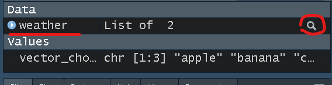
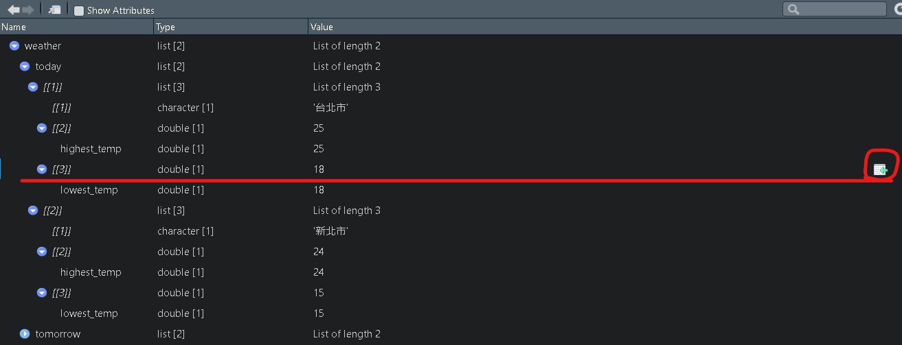
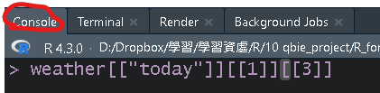
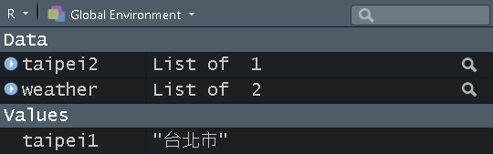
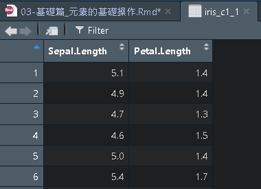

# 基礎篇_元素的基礎操作

## 值與元素

上一章節說明了一些基礎概念，而在進行一下部分的操作時，還需要釐清一下「值(values)」與「元素(element values)」的概念，

我們先看一個範例:

```{r eval=FALSE}
value1 <- "apple"
value2 <- 1
value3 <- TRUE
value4 <- c(1, 2, 3)
value5 <- list("apple", TRUE)
value6 <- list("apple", 1, list("banana", 2))
```

上面的程式碼中，每一行都可以當作是一個值，`apple`、`1`、`TRUE`，分別屬於單一的文字、數字、邏輯，都視為**「一個值」**，而由`c(1, 2, 3)`組成的向量、由`list("apple", TRUE)`組成的列表、由`list("apple", 1, list("banana", 2))`所組成列表(當中單含另一個列表)也同樣都視為**「一個值」**。

若是像第二種是由向量或列表所組成的(`value4、value5、value6`)，他們內部也會包含著值，這些被包含的值就會稱之為**「元素」**

也就是說像是剛剛的由`c(1, 2, 3)`組成的向量，他本身是一個值，且其中包含了三個元素，分別是1、2、3

```{r}
value4 <- c(1, 2, 3)
value4_element1 <- 1 ## 第一個元素
value4_element2 <- 2 ## 第二個元素
value4_element3 <- 3 ## 第三個元素
```

可以簡單的想像，每一個元素是由`,`或著`;`所隔開的，並且不能在同一個向量或列表內。

例如上述的`value6`，本身是一個列表，其中還包含列外一個列表，但`value6`中的元素就只有三個，分別是`apple`、`1`、`list("banana", 2)`，而`banana`、`2`，則是`list("banana", 2)`中的元素

```{r}
value6 <- list("apple", 1, list("banana", 2))

value6_element1 <- "apple" ## 第一個元素
value6_element2 <- 1 ## 第二個元素
value6_element3 <- list("banana", 2) ## 第三個元素
```

## 元素位置

剛剛了解到值和元素的不同，接著我們可以進一步的對「元素」開始進行各種操作，

舉例來說，假設今天有一份資料，我們想在R語言對這份的資料的某一個數據進行更動，且這個數據是包含在某個向量當中，因此這個數據就是當中的**元素**，這時如果我們想要只單獨查看這個元素，或是想要更改這個元素，就位需要對其進行一些判斷與操作。

如何進行這些操作的最重要關鍵就是需要先**判斷「元素的位置(Position)」**，在我們能知道個元素是在哪個位置時，就能夠很輕易地去進一步操作。

**元素的位置**: 對於由`,`或著`;`隔開所構成的元素，美個元素都有一個位置，而個位置是由1、2、3...來排序(由1開頭)，1為第一個位置、2為第二個位置，以此類推。

例如上述的`value6`，`apple`在第一個位置、`1`在第二個位置、`list("banana", 2)`在第三個位置

```{r}
value6 <- list("apple", 1, list("banana", 2))

value6_position1 <- "apple" ## 第一個位置
value6_position2 <- 1 ## 第二個位置
value6_position3 <- list("banana", 2) ## 第三個位置
```

另外位置是可以連接起來的，

例如上述的`value6`，`list("banana", 2)`在`value6`的第三個位置，但是其中的`banana、2`卻是在`list("banana", 2)`中的第一、二個位置。

也就是我們可以將`banana`視為是在`value6`的「第三 -\> 一」個位置，這部份我們等等會在解釋。

## 檢索/取出元素

檢索元素時，第一步就是必須知道該元素的位置，而透過這個位置我們就可以檢索/取出該元素。

### 檢索/取出vector中的元素

假設今天有一個`vector_choose`的資料，其中包含兩個文字型態的元素(apple,banana)。

```{r}
vector_choose <- c("apple", "banana")
```

接著我們可以使用`length()函數`，來查看這個物件多少位置可選(該物件的長度)，\
以下範例，`vector_choose`長度總共為3

```{r}
length(vector_choose) ## [1] 2
```

這時我們可以知道`vector_choose`長度總共為2，且裡面的元素是(apple,banana)，這個資訊我們也可以從旁邊的R語言暫存環境中看到，同時也可以知道apple在第一個位置、banana在第二個位置。


最後就可以開始選取`vector_choose`中的元素，

假設我們想取出apple，可以使用兩個中括號`[[]]`加上已知apple的位置來取出。

```{r}
vector_choose <- c("apple", "banana")

# 取出apple
vector_choose[[1]] ## [1] "apple"
```

也可以用**負向的表示**取出，此方法是**刪除banana的位置**，因此只留下apple。

```{r}
vector_choose[[-2]] ## [1] "apple"
```

最後也可以用**布林變數**(TRUE、FALSE)來取出，apple的位置是TRUE、banana的位置是FALSE。

```{r}
vector_choose[c(T, F)] ## [1] "apple"
```

### 取出list中的元素

若要選取list中的元素，方法和前面取出向量中的元素類似，但不同的是list可能有更複雜的位置結構，但同樣能判斷出元素位置在哪就能進行操作。

以下範例為以台北市和新北市今日氣溫組成的list加上台北市和新北市明日氣溫組成的list，兩個list合併成一個名稱為`weather`的list

我們可以先用`print()函數`將`weather`的架構直接輸出

```{r}
weather <- 
  list(
    today = list(
      list("台北市", c(highest_temp = 25)),
      list("新北市", c(highest_temp = 24))
    ),
    tomorrow = list(
      list("台北市", c(highest_temp = 30)),
      list("新北市", c(highest_temp = 28))
    ) 
  )
  
# 查看整個list的架構或如下圖方式點選
print(weather)
```

若想較簡易得知list中元素位置，可以直接點選







若我們想取出weather當中today裡面的「台北市」，按照上面的方法可以得知位置是:

```{r}
weather[["today"]][[1]][[1]]
```

但除了上述方法，也有其他符號可以代替，在有對list裡面的元素**命名**時，用`$`也可以取出元素

```{r}
weather$today[[1]][[1]] ## [1] "台北市"
```

### `[[]]`和`[]` 差異

在選取元素位置時，有時可以看到選取資料時有`[[]]`和`[]`兩種，在此我們可以做個簡單比較:

taipei1是使用`[[]]`

```{r}
# 比較[[]] 和 [] 差別
taipei1 <- weather$today[[1]][[1]] 
taipei1 ## [1] "台北市"
```

taipei2是使用`[]`

```{r}
taipei2 <- weather$today[[1]][1]
taipei2 ## [[1]] [1] "台北市"
```

在此我們可以看到使用`[]`還保留原來的結構，但是使用`[[]]`就會當純取出「台北市」這個元素

`[[]]`: 拿出某個物件值。`weather$today[[1]][[1]`將weather中today裡的台北市物件值**拿出來**，因此只留下單純的值。

`[]`: 留下某個物件值。`weather$today[[1]][1]`**只留下**weather中today裡的台北市，因此原先資料結構和名稱仍會留下。



以下可以練習看看: 取出tomorrow當中新北市的highest_temp值(25) 並**保留**highest_temp的名稱

```{r}
weather$tomorrow[[2]][[2]] ## highest_temp 28
weather$tomorrow[[2]][[2]][1] ## highest_temp 28
```

取出tomorrow當中新北市的highest_temp值(25) 並**捨棄**highest_temp的名稱

```{r}
weather[["tomorrow"]][[2]][[2]][["highest_temp"]] ## [1] 28
## or
weather$tomorrow[[2]][[2]][[1]] ## [1] 28
```

### 取出data frame中的元素

若想取出data frame中的元素，概念仍然根前面兩個相同，而不一樣的地方在於data frames是由**「行/列」**所組成，因此在考慮位置時也需要考慮所處的「行/列」

首先我們先載入R內建的資料檔案`iris`(檔案中包括鳶尾花的一些特徵)，載入後一樣可以先從旁邊直接點開瀏覽一下檔案

```{r}
#取得R內建資料
data(iris)

# 查看欄位名稱
names(iris)
```


此時想取出第一列(row)第二行(欄)(column)的數值 (直行橫列)

```{r}
iris[1, 2] ## [row, column]
```


若只想取出第一、三行的資料

```{r}
iris_c1_1 <- iris[, c(1, 3)]
## or
iris_c1_2 <- iris[, c("Sepal.Length", "Petal.Length")] ## 用欄位名稱選取
## or
c13 <-c ("Sepal.Length", "Petal.Length")
iris_c1_3 <- iris[, c13]
## or
iris_c1_4 <- iris[, c(T, F, T, F, F)] ## 用布林變數選取

# 若只想取出一行，除了上述方法也可以用「$」選取
iris_c1_5 <- iris$Sepal.Length ## 用欄位名稱選取
```



## 替換元素

若要替換元素，我們可以接續上述的檢索/取出元素，在我們檢索出某一個元素值時，將想要的元素**重新指派**到原先的位置後，就能夠替換了。

也就是首先我們還是必須先知道要替換元素的位置，\
1. 找出需要替換元素的位置\
2. 將要替換的值指派到需要替換元素的位置

以下範例，`vector_replace1`是由apple、banana、cat組成，若想在`vector_replace1`中的banana替換成`二`:

先創建`vector_replace1`，並判斷位置

```{r}
vector_replace1 <- c("apple", "banana", "cat")
length(vector_replace1)
```

1.  找出需要替換元素的位置

可以知道`vector_replace1`中的banana是在第二個位置

```{r}
vector_replace1[[2]] ## 存在"banana"
```

2.  將要替換的值指派到需要替換元素的位置

因此若想在`vector_replace1`banana替換成`二`，需要將`二`指派到`vector_replace1` 的第二個位置

```{r}
vector_replace1[[2]] <- "二"
vector_replace1
```

另外我們也可以一次替換多個元素，但同樣也需要指定位置

```{r}
vector_replace2 <- c("apple", "banana", "cat")
vector_replace2[1:2] <- c("一", "二") ## 此時apple和banana會變成一、二
vector_replace2
## or
vector_replace3 <- c("apple", "banana", "cat")
vector_replace3[c(1, 3)] <- c("一", "三") ## 此時apple和cat會變成一、三
vector_replace3
```

也可以同時新增和替換元素

```{r}
vector_replace3 <- c("apple", "banana", "cat")
vector_replace3[c(1, 3, 4)] <- c("1", "3", "4")
vector_replace3
```

其他list或data frame的替換也是類似相同概念

## 新增元素

若要新增元素、首先我們必須知道元素的位置，也就是上一章節詳細介紹元素的部分，\
1. 找出不存在的位置\
2. 將要新增的值指派到不存在元素的位置

以下範例，`vector_add1`是由apple、banana、cat組成，若想在`vector_add`中的cat後面新增一個`四`:

先創建`vector_add1`，並判斷位置

```{r}
vector_add1 <- c("apple", "banana", "cat")
length(vector_add1)
```

1.  找出不存在的位置

``` {reval="FALSE"}
vector_add1[[3]] # 存在"cat"
vector_add1[[4]] # 不存在元素(會出現Error)
```

2.  將要新增的值指派到不存在元素的位置

剛剛已知第四個位置是不存在的，因此若想在cat後面新增一個`四`，需要將「四」直接指派到不存在的那個位置

```{r}
vector_add1[[4]] <- "四"
vector_add1
```

原先`vector_add1`是只有三個位置，上面範例是新增到第四個位置，若是直接新增到第五個位置，那麼第四個位置會顯示成NA

```{r}
vector_add1 <- c("apple", "banana", "cat")
vector_add1[[5]] <- "四"
vector_add1
```

另外我們也可以一次新增多個元素，但同樣也需要指定位置

```{r eval=FALSE}
# 也可以新增多個元素
vector_add2 <- c("apple", "banana", "cat")
vector_add2[4:6] <- c("四", "五", "六")
vector_add2
## or
vector_add3 <- c("apple", "banana", "cat")
vector_add3[c(4, 6, 7)] <- c("四", "六", "七") # 此時第5個位置會變成NA
vector_add3
```

其他list或data frame的新增也是類似相同概念

## 刪除元素

若要刪除元素有兩種方式，\
同樣先找出需要刪除元素的位置\
**第一種**: 只取出需要的元素，再指派到原先的物件(沒有取出的，即是刪去)

**第二種**: 取出不需要(要刪除)的元素，用`-`指派到原先的物件(回存`-`即是刪去)，但這個只能用在向量不能使用在列表

例如，若想將範例`vector_delete`中原先的`"apple"`和`"cat"`刪除:

以下範例，`vector_delete1`是由apple、banana、cat組成，若想在`vector_delete1`中的`"apple"`和`"cat"`刪除:

先創建`vector_delete1`，並判斷位置

```{r}
vector_delete1 <- c("apple", "banana", "cat")
length(vector_delete1)
```

1.找出需要刪除元素的位置

```{r}
vector_delete1[c(1, 3)] ## apple和cat
```

2_1. 取出需要的元素banana再指派到原先的物件(vector_delete1)，沒有取出的，即是刪去

```{r}
vector_delete1 <- c("apple", "banana", "cat")
vector_delete1 <- vector_delete1[[2]]
vector_delete1 ## 只剩下banana，apple和cat則被刪除
```

2_2. 取出不需要(要刪除)的元素(apple和cat)，用`-`指派到原先的物件

```{r}
vector_delete1 <- c("apple", "banana", "cat")
vector_delete1 <- vector_delete1[-c(1, 3)]
vector_delete1
```

另外list的形式是用**`NULL`**來刪除，類似替換的概念，但替換成`NULL`(空的)

例如，若想將範例`weather2`中的`"台北市"`刪除:

先創建`weather2`查看架構

```{r}
weather2 <- 
  list(
    today = list(
      "台北市", 
      c(highest_temp = 25)
    ),
    "新北市"
  )

print(weather2)
```

找出需要刪除元素(台北市)的位置

```{r}
weather2$today[[1]]
```

用**「NULL」**來替換(刪除)

```{r}
weather2$today[[1]] <- NULL
weather2
```

## 判斷位置的其他方法

在上述了解元素的操作後，我們還可以根據元素進行位置的判斷，\
可以使用`which()`和`%in%`\

`which()`函數是進行()中的條件邏輯判斷，並返回位置\
`x %in% y` 是針對左邊x是否包含在右邊y中，並返回邏輯值

```{r}
vector_which <- c("apple", "banana", "cat")

which(vector_which == "apple") ## 返回apple的位置1
which(vector_which != "apple") ## 返回不是apple的位置2、3
which(c(T,F,T)) ## 返回c(T,F,T)中為TURE值的位置。

vector_which %in% "apple" ## 返回邏輯值，apple的位置為TURE，不是的為FALSE
```

## 元素命名

若要對元素進行命名，需使用`"name"=value`，\
在命名時只能夠使用`=`，不能使用`<-`

另外在命名時，也可以使用\`，如果是常規的命名，也可以都不加\
或者可以使用`setNames`、`names()`相關函數

以向量為例，想對1、2、3分別命名為apple、banana、cat

```{r}
vector_name <- c(1, 2, 3)
vector_name
```

方法1，使用""

```{r}
vector_name1 <- c("apple" = 1 , "banana" = 2 , "cat" = 3)
vector_name1
```

方法2，使用\`

```{r}
vector_name2 <- c(`apple` = 1 , `banana` = 2 , `cat` = 3)
vector_name2
```

方法3，常規的命名，都不加

```{r}
vector_name3 <- c(apple = 1 , banana = 2 , cat = 3)
vector_name3
```

方法4，用setNames()函數

```{r}
vector_name4 <- setNames(c(1, 2, 3), c("apple", "banana", "cat"))
vector_name4
```

方法5，用names()函數

```{r}
vector_name5 <- c(1, 2, 3)
names(vector_name5) <- c("apple", "banana", "cat")
vector_name5
```


另外若元素有命名，前面的選取、新增等操作中，也可以用命名的文字來取代位置

```{r}
vector_name <- c(1, 2, 3)
vector_name[[1]]

vector_name1 <- c("apple" = 1 , "banana" = 2 , "cat" = 3)
vector_name1[["apple"]]
```
