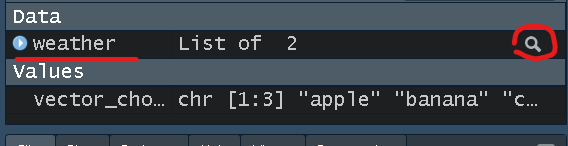
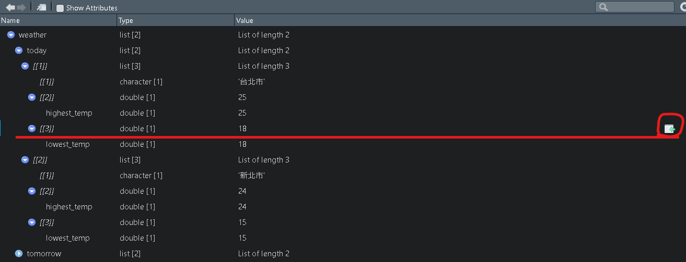

# 基礎篇_選取、新增、替換與刪除元素

## 選取
### 取出vector中的元素
```{r eval=FALSE}
vector_choose <- c("apple","banana","cat")

# 有多少位置可選(該元素的長度)：
length(vector_choose)
```


```{r eval=FALSE}
# 取出apple
vector_choose[[1]]
head(vector_choose, 1) ##取出vector_choose向量的前n個元素

# 取出banana和cat
vector_choose[c(2, 3)]
vector_choose[c(2:3)]
tail(vector_choose, 2) ##取出vector_choose向量的後n個元素
```

### 取出list中的元素
```{r eval=FALSE}
weather <- 
  list(
    today = list(
      list("台北市", c(highest_temp = 25)),
      list("新北市", c(highest_temp = 24))
    ),
    tomorrow = list(
      list("台北市", c(highest_temp = 30)),
      list("新北市", c(highest_temp = 28))
    ) 
  )
  
# 查看整個list的架構或如下圖方式點選
print(weather)
```

若想較簡易得知list中元素位置，可以直接點選(如下圖)   

```{r eval=FALSE}
# 取出today當中的台北市 (若有名稱時[[""]] 和$ 可以相互使用)
weather[["today"]][[1]][[1]]
## or
weather$today[[1]][[1]]

#比較[[]] 和 [] 差別
taipei1 <- weather$today[[1]][[1]]
taipei2 <- weather$today[[1]][1]
taipei1
taipei2
```

上述可以看到選取資料時有`[[]] 和 []`兩種，差別在於:

`[[]]`: 拿出某個物件值。`weather$today[[1]][[1][[1]]`將weather中today裡的台北市物件值**拿出來**，因此只留下單純的值。

`[]`: 留下某個物件值。`weather$today[[1]][[1][1]`**只留下**weather中today裡的台北市，因此原先資料結構和名稱仍會留下。

如下圖taipei2還是list的結構，但taipei1是單純的Value。\


```{r eval=FALSE}
# 取出tomorrow當中新北市的highest_temp值(25) 並保留highest_temp的名稱
weather$tomorrow[[2]][[2]] 
weather$tomorrow[[2]][[2]][1]

# 取出tomorrow當中新北市的highest_temp值(25) 並捨棄highest_temp的名稱
weather[["tomorrow"]][[2]][[2]][["highest_temp"]] 
## or
weather$tomorrow[[2]][[2]][[1]]
```

### 取出data.frame中的元素
```{r eval=FALSE}
#取得R內建資料
data(iris)

# 查看欄位名稱
names(iris)

#想取出第一列(row)第二行/欄(column)的數值 (直行橫列)
iris[1, 2] # [row, column]

#想取出第一、三行的資料
iris_c1_1 <- iris[, c(1, 3)]
## or
iris_c1_2 <- iris[, c("Sepal.Length", "Petal.Length")] # 用欄位名稱選取
## or
c13 <-c ("Sepal.Length", "Petal.Length")
iris_c1_3 <- iris[, c13]
## or
iris_c1_4 <- iris[, c(T, F, T, F, F)] # 用布林變數選取

# 若只想取出一行，除了上述方法也可以用「$」選取
iris_c1_5 <- iris$Sepal.Length # 用欄位名稱選取
```

## 新增
若要新增元素、首先我們必須知道元素的位置，也就是上一章節詳細介紹元素的部分，\
1. 找出不存在的位置\
2. 給予這個不存在位置一個值

例如，若想將範例`vector_choose`中新增一個`"4"`:
```{r eval=FALSE}
vector_choose <- c("apple","banana","cat")
vector_choose

# 1.找出不存在的位置
## vector_choose 只有三個元素、因此第四個位置的元素是不存在的
vector_choose[[3]] # 存在"cat"
vector_choose[[4]] # 不存在元素(會出現Error)

# 2. 給予這個不存在位置一個值
## 因此若想在vector_choose加上第四個元素"4"，
## 需要將"dog" 指派到vector_choose 的第四個位置
vector_choose[[4]] <- "4"
vector_choose

# 也可以新增多個元素
vector_choose <- c("apple","banana","cat")
vector_choose[4:6] <- c("4", "5", "6")
vector_choose
## or
vector_choose <- c("apple","banana","cat")
vector_choose[c(4, 6 , 7)] <- c("4", "6", "7") # 此時第5個位置會變成NA
vector_choose
```

其他list或data.frame的新增也是類似相同概念

## 替換
若要替換元素、首先我們還是必須先知道要替換元素的位置，\
1. 找出需要替換元素的位置\
2. 給予這個需要替換元素的位置另一個值

例如，若想將範例`vector_choose`中原先的`"banana"`，替換成`"2"`:
```{r eval=FALSE}
vector_choose <- c("apple","banana","cat")
vector_choose

# 1.找出需要替換元素的位置
## vector_choose "banana"是在第二個位置
vector_choose[[2]] # 存在"banana"

# 2. 給予這個需要替換元素的位置另一個值
## 因此若想在vector_choose加上第四個元素"4"，
## 需要將"dog" 指派到vector_choose 的第四個位置
vector_choose[[2]] <- "2"
vector_choose

# 也可以替換多個元素
vector_choose <- c("apple","banana","cat")
vector_choose[1:2] <- c("1", "2") # 此時"apple"和"banana"會變成"1"、"2"
vector_choose
## or
vector_choose <- c("apple","banana","cat")
vector_choose[c(1, 3)] <- c("1", "3") # 此時"apple"和"cat"會變成"1"、"3"
vector_choose

#也可以同時新增和替換元素
vector_choose <- c("apple","banana","cat")
vector_choose[c(1, 3, 4)] <- c("1", "3", "4")
vector_choose
```

其他list或data.frame的替換也是類似相同概念

## 刪除
若要刪除元素有兩種方式，\
同樣先找出需要刪除元素的位置\
第一種:\
取出需要的元素，再回存自己(沒有取出的，即是刪去)\
第二種:\
取出不需要的元素，用`-`回存自己(回存`-`即是刪去)(只能用在vector)

例如，若想將範例`vector_choose`中原先的`"apple"`和`"cat"`刪除:
```{r eval=FALSE}
vector_choose <- c("apple","banana","cat")
vector_choose

# 1.找出需要刪除元素的位置
vector_choose[c(1, 3)] 

# 2. 取出需要的元素("banana")再回存自己(沒有取出的，即是刪去)
vector_choose <- vector_choose[[2]]
vector_choose
## or 取出不需要的元素("apple"、"cat")
vector_choose <- vector_choose[-c(1, 3)]
vector_choose
```
另外list的形式是用`NULL`來刪除，\
類似替換的概念，但替換成`NULL`(空的)

例如，若想將範例`weather`中原先的`"台北市"`刪除:
```{r eval=FALSE}
weather <- 
  list(
    today = list(
      "台北市", 
      c(highest_temp = 25)
    )
  )

weather
#"台北市"的位置
weather$today[[1]]

#替換成NULL(刪除)
weather$today[[1]] <- NULL
weather
```
