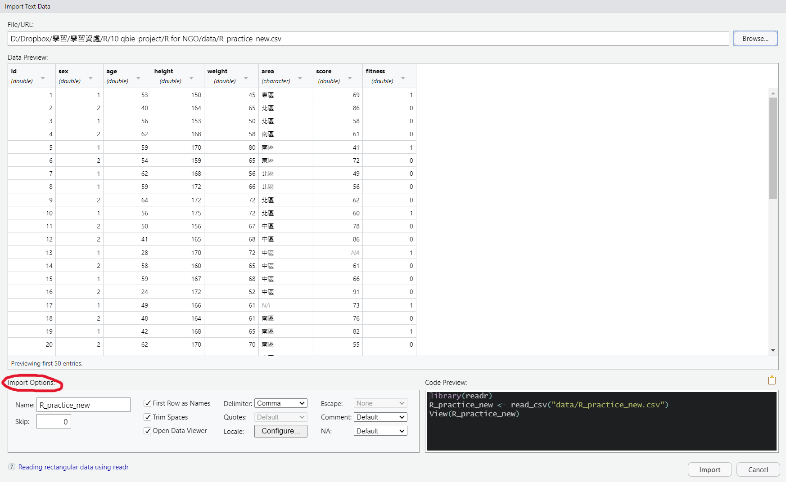
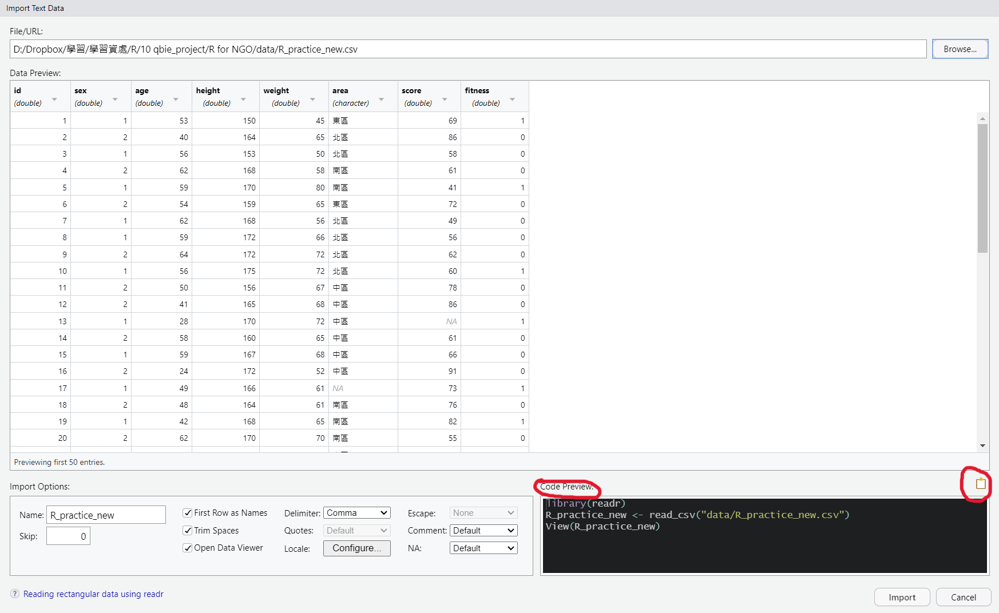
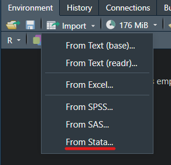
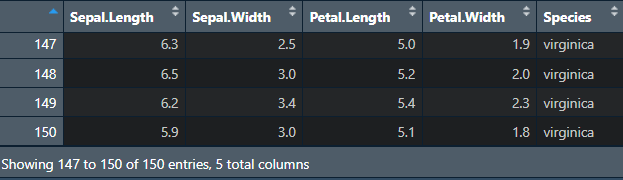

# 應用篇_資料讀取、匯出、合併與瀏覽

## 設定工作路徑

首先可以先設定放檔案路徑，(需要注意的是在路徑上平常多是使用`\`，但在R中需要使用`/)`

設定好路徑之後，讀取或匯出資料就只需要寫檔案名稱，不用加上前面路徑，會直接存在設定路徑的資料夾中，若檔案需要放在另外位置，也只須在檔名前面加上需要存取的位置

可以對需要存放的資料夾按\
右鍵-\>內容-\>位置或是右鍵-\>複製路徑\
查看資料夾的路徑

若是使用R Project打開，除非需要更換路徑，不然預設就是R Project的資料夾

```{r eval=FALSE}
#設定工作路徑
setwd("D:/Dropbox/R_for_NGO") 
```

## 讀取資料

常見的Open Data儲存方式包括

-   表格式檔案（包含 CSV 資料(.csv)、Excel 試算表(.xlsx)、spss(.sav)、stata(.dta)、SAS(.sas7bdat)）
-   非表格式檔案（包含 TXT 資料、JSON 資料、XML資料）

但大多數的公開資料都可以**直接下載CSV檔案**，或是調查資料大多都有提供spss、stata或SAS的檔案格式，因此在此先介紹這個較簡單的方式，\

另外其他透過網路爬蟲、API或JSON與XML格式的資料，暫不多做介紹，有興趣者可以到以下連結查看[參考1](https://yijutseng.github.io/DataScienceRBook/io.html#api)、[參考2](https://eloquentr.datainpoint.com/webScraping.html#%E5%AE%89%E8%A3%9D%E8%88%87%E8%BC%89%E5%85%A5%E5%A5%97%E4%BB%B6)、[參考3](https://cran.r-project.org/doc/manuals/r-release/R-data.html)

### Import Dataset功能 (RStudio)

若是檔案為可直接下載(表格式檔案式)，包括文字檔、其他軟體的檔案格式，\
在RStudio當中有提供直接點選讀取資料的功能，包括純文字.txt、.cvs、或Excel試算表.xslx、spss、SAS、Stata的檔案格式

下圖以讀取WVS_w7的.cvs檔案為範例，\
1. 點選`Import Dataset` -\> `From Text(readr)...`\
2. 出現視窗後點選左上角`Browse`，點選要輸入的檔案\
3. 之後空白處會載入部分資料提供預覽，可以根據需求更改參數(左下角)\
4. 右下角也有提供程式碼，且就是根據你點選的方式呈現，可以點選完後複製程式碼(右下有個類似紙的圖案)，這樣就可以留下讀檔案的紀錄\
5. 若檔案中文字有亂碼也是在左下更改




\


```{r eval=FALSE}
# 讀取WVS_w7的.cvs檔案
library(readr)
data <- read_csv("data/WVS_w7/data.csv")
View(data)

# 但此時文字可能會有亂碼狀況，可以設定編碼
library(readr)
data <- read_csv("data/WVS_w7/data.csv", 
    locale = locale(encoding = "BIG5"))
View(data)

# 上面預設是讀取後命名為data，也可以自行更改
WVS_w7 <- read_csv("data/WVS_w7/data.csv")
```


```{r eval=FALSE}
# 或著讀取WVS_w7的.dta檔案
library(haven)
data <- read_dta("data/WVS_w7/data.dta")
View(data)
```

## 匯出檔案

在R處理完檔案後，通常會將檔案匯出成其他另外檔案提供其他人使用，較常匯出使用的檔案格式tab分隔的文字檔`.txt`或是逗號分隔的文字檔`.csv`，有一些格式上的呈現可以另外再進行參數設定，這邊只會介紹簡單的匯出形式，若要調整可參考該函數的help文件

### R物件.rds

若是處理到一半，之後還要繼續用R處理，可以先匯出成R物件檔案`.rds`，較方便自己下次處理，後續最後處理完成再轉換成其他常見檔案

```{r eval=FALSE}
#取得R內建資料
data(iris)

saveRDS(iris, "iris.rds") ## 前面是data名稱、後面是要存的檔案名稱
```

### 文字檔.txt

```{r eval=FALSE}
#查詢write.table的help文件
?write.table

#取得R內建資料
data(iris)

#匯出成.txt檔案
write.table(iris, file = "iris.txt", sep = ",", row.names = F, col.names = T)
```

`write.table`的help文件，文件後面也有針對每個參數的描述 

### CSV檔.csv

```{r eval=FALSE}
#查詢write.csv的help文件
?write.csv

#取得R內建資料
data(iris)

write.csv(iris, file = "iris.csv", row.names = F)
```

### Excel 試算表.xslx

存成`.xlsx`需另外使用其他套件，在此使用的是`writexl`，但也有其他的套件也可以輸出成.xlsx(如`openxlsx`)

```{r eval=FALSE}
#載入writexl套件
library(writexl)

#查詢write_xlsx的help文件
?write_xlsx

#取得R內建資料
data(iris)

write_xlsx(list(iris = iris), "iris.xlsx") 
```

## 簡單資料合併

在資料當中有時需要新增整列或整行的資料，\
可以使用`rbind()`和`cbind()`來完成(vector或是data.frame都適用)

若今天想在`iris`資料中加入新的一列(原先有150筆資料新增一筆)

```{r eval=FALSE}
# vector
rbind(c(1, 2, 3), #第一列
      c("apple", "banana", "cat")  #第二列
      ) 

# 取得R內建資料
data(iris)
names(iris)

# 新增成另一個資料
iris_nrow <- rbind(iris, #資料框
      c(1, 2, 3, 4, "setosa")  ## 新增一列
      ) 

## or
# 直接更換原先的資料
iris <- rbind(iris, #資料框
      c(1, 2, 3, 4, "setosa")  ## 新增一列
      ) 
```



\

若今天想在`iris`資料中加入新的一行(原先有四行)

```{r eval=FALSE}
# vector
cbind(c(1, 2, 3), #第一行
      c("apple", "banana", "cat")  #第二行
      ) 

#取得R內建資料
data(iris)
names(iris)

# 新增成另一個資料
iris_newcol <- cbind(iris, ## 資料框
      rep("newcol", nrow(iris))  ## 自行新增一行、或是有對應的資料可以直接新增
      ) 
```

\

### 其他資料轉換

#### dplyr套件提供更有效率的資料結合方法

在資料想以某個欄位為依據進行合併時(像是長期資料，想以個人id將兩波資料合併)，\
可以使用R原先內建的`merge`或是用dplyr套件提供的相關指令\
詳細可以查看[參考1](https://yijutseng.github.io/DataScienceRBook/manipulation.html#%E8%B3%87%E6%96%99%E7%B5%90%E5%90%88-join)、[參考2](https://rforhr.com/join.html)的整理


```{r eval=FALSE}
# 增加變數：使用R base的merge
merge(data_frame1, data_frame2, by="idvar", all=TRUE)

# 增加觀察值：使用dplyr的bind_rows()
library(dplyr)
bind_rows(data_frame1, data_frame2)
```

#### 長寬資料轉換

在處理特殊資料或是一些特殊統計分析時，可能需要將資料做長寬轉換處理，`tidyr`套件中提供的兩個好用的函數`pivot_longer()`、`pivot_wider()`，\
在此並不多作介紹，有興趣可以查看[參考1](https://r4ds.had.co.nz/tidy-data.html#pivoting)、[參考2](https://www.r4epi.com/restructuring-data-frames.html#pivoting-longer)

## 資料瀏覽

若已經將資料讀取到R裡面，一開始需要看一下或檢查資料的大致狀況如何\
以內建資料`iris`為例:

### 資料屬性查詢函數

```{r eval=FALSE}
# 讀取WVS_w7資料
library(readr)
WVS_w7 <- read_csv("data/WVS_w7/data.csv", 
                   locale = locale(encoding = "BIG5"))

# 查看資料內容
View(WVS_w7) ## 查看資料
head(WVS_w7) ## 查看前6筆資料內容
tail(WVS_w7) ## 查看後6筆資料內容

# 查看資料各種名稱
names(WVS_w7) ## 顯示資料名稱
colnames(WVS_w7) ## 顯示欄位名稱
rownames(WVS_w7) ## 顯示列名稱(若沒有則顯示編號)
dimnames(WVS_w7) ## 先顯示列再顯示欄位的名稱

# 查看資料長度 
length(WVS_w7) ## 顯示資料查度(若為data.frame會顯示欄位數)
dim(WVS_w7) ## 先顯示列再顯示欄位的長度

# 顯示資料的架構資訊
str(WVS_w7) 
class(WVS_w7$a01) ## 數值資料
class(WVS_w7$m25s) ## 文字資料

# 簡單查看資料分配
table(WVS_w7$a01) ## a01(性別)次數分配
table(WVS_w7$m25s) ## m25s(投票給政黨選擇其他的回答)次數分配

# 上述函數也可以合併使用
## 顯示前6筆資料的a01(性別)次數分配
table(head(WVS_w7)$a01)
```

### 資料排序

另外也可以對向量或資料進行排序

```{r eval=FALSE}

nosort <- c(1, 6, 5, 8, 2, 3)
sort(nosort) ## 預設是由小排到大
sort(nosort, decreasing = T) ## 由大排到小

# 讀取WVS_w7資料
library(readr)
WVS_w7 <- read_csv("data/WVS_w7/data.csv", 
                   locale = locale(encoding = "BIG5"))

head(WVS_w7$a01) ## 顯示a01(性別)前6筆資料
head(sort(WVS_w7$a01)) ## 顯示排序之後的Sepal.Width前6筆資料

head(order(WVS_w7$a01)) ## 顯示排序之後前6筆資料的原始位置(由小到大)
head(order(WVS_w7$a01, decreasing = T)) ## 顯示排序之後前6筆資料的原始位置(由大到小)

## 根據排序之後的a01(性別)前6筆資料的原始位置，來排序整個資料
head(WVS_w7[order(WVS_w7$a01), ]) 
```
