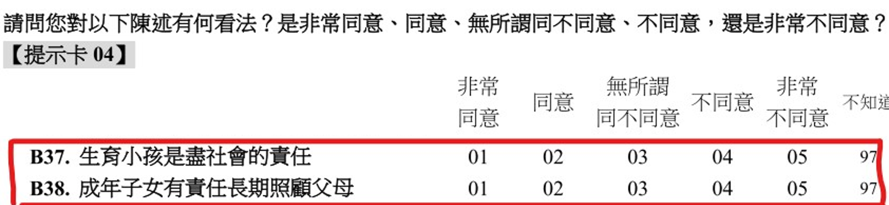
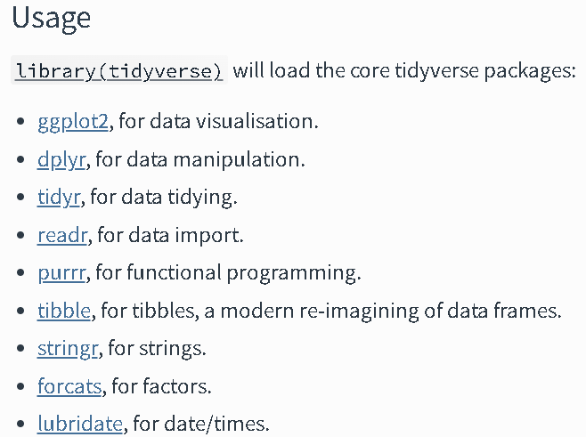
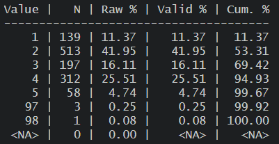
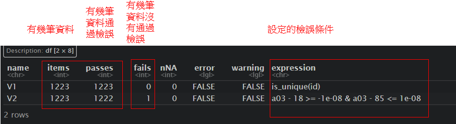
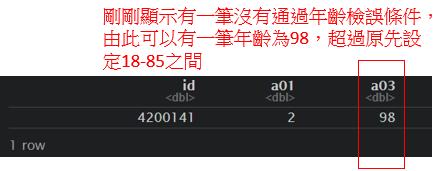
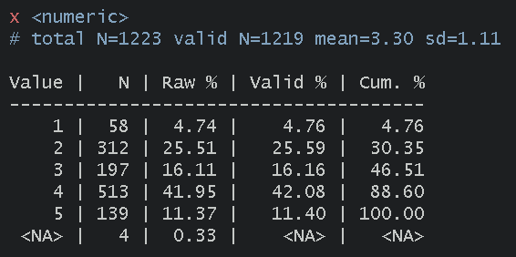
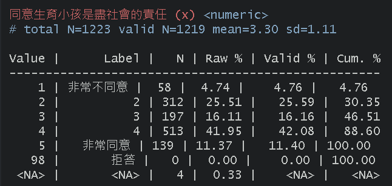

# 應用篇_實作簡單資料處理

接下來會使用前面範例的WVS_w7中CSV格式的檔案，來繼續示範資料的初步清理與整理，

以下範例會以關於台灣中生育小孩及照顧父母這兩個的價值觀作為簡單的發想進行操作，\
**「不同性別、年齡、平均月收入的人會如何思考-\>生育小孩是盡社會的責任與成年子女有責任長期照顧父母」**

上一章節有介紹過一些瀏覽資料的語法，在此因為我們匯入的是沒有標籤的csv資料，各個變項與值代表什麼可以到**調查問卷或codebook**查看，

\
由此可知B37變項所代表的是「是否同意生育小孩是盡社會的責任」，且值代表的是「1是非常同意、5是非常不同意」\
由此可知B38變項所代表的是「是否同意成年子女有責任長期照顧父母」，且值代表的是「1是非常同意、5是非常不同意」

從問卷可得知以下面變項再資料當中題號、題目與值代表的意思:\
(問卷的題號有時也會跟資料不太一樣，以此份資料為例，問卷為大寫字母、而資料為小寫字母)

-   性別 = A01
-   年齡 = A03
-   平均月收入 = A21_3
-   生育小孩是盡社會的責任 = B37
-   成年子女有責任長期照顧父母 = B38

## 前置準備

### 讀取需要使用套件

以下為資處常使用的套件:\
大部分的資處會使用到一個整合性的套件[tidyverse](https://tidyverse.tidyverse.org/index.html)(上述連結點進去後，可以根據不同套件的連結查看套件的cheatsheet)，其功能非常強大，在此只會簡單介紹關於資處的部分內容，

\

**在接續下面分析前請先library以下套件**

```{r eval=FALSE}
library(tidyverse) # 大部分的資處工具
library(data.table) # 高效能資處工具
library(DescTools) # 初步描述統計
library(sjmisc) # 設置缺失值
library(sjlabelled) # 上標籤用
library(validate) # 資料檢誤
```

接下來關於資料清理的部分，並不會特別單一仔細的講解，而是會使用**簡單的實際例子**來呈現，並適時補充一點額外的解釋，當然由於R語言的功能強大有很多套件，也持續在整合並強化，下面介紹的資料清理可能**不會是唯一**的方式，也不一定是最有效率方式，但仍可以稍微參考。

### 設定工作路徑

```{r eval=FALSE}
setwd("D:/Dropbox/R_for_NGO") 
```

### 讀取檔案

```{r eval=FALSE}
library(readr)
WVS_w7 <- read_csv("data/WVS_w7/data.csv", 
    locale = locale(encoding = "BIG5"))
```

### 選取需要的變項到新的資料檔中

```{r eval=FALSE}
WVS_w7_n1 <- WVS_w7[c("id", "a01", "a03", "a21_3", "a32", "b37", "b38")]
```

### 瀏覽資料

查看變項初步分配，來檢查是否有不合理值或缺失值\
(以下指令都還有各自呈現的細節可以調整，可自行查看該指令的help)

```{r eval=FALSE}
# 初步查看次數分配(以b37為例)
table(WVS_w7_n1$b37, useNA = "always") ## 呈現簡單次數分配(useNA 是設定列出是否有NA) 

frq(WVS_w7_n1$b37) ## 呈現更多內容的次數分配表與簡單描述統計
```

\
上圖為`frq(WVS_w7$b37)`的結果，我們初步得知此資料當中，b37變項有多少人/比例回答非常同意或非常不同意，但須注意可以看到有97、98的選項，從問卷當中可得知「97是不知道、98是拒答」，回答這兩個選項的應該是不會被納入分析當中，接下來也會說明如何處理，

## 資料檢誤

一開始可能可以做一些「資料檢誤」的工作來檢查資料，`validate`就是較有效率處理的套件，以下只做簡單介紹，更多詳細檢誤方式可以[參考1](https://cran.r-project.org/web/packages/validate/vignettes/cookbook.html#Preface)、[參考2](https://uribo.github.io/rpkg_showcase/utility/validate.html)

```{r eval=FALSE}
# 以下簡單設定幾個檢誤條件
rules <- validator(
  is_unique(id), ## 檢查是否有重複id
  a03 >= 18 & a03 <= 85 ## 檢查年齡是否在18-85之間(資料只對18-85歲抽樣)
)

out <- confront(WVS_w7_n1, rules) ## 前面放使用data，後面放檢誤規則
results <- summary(out) %>% ## 呈現檢誤結果
  as.data.frame()
results

vilt = violating(WVS_w7_n1, out[2]) ## 查看那些資料是不符合檢誤的條件，out中是設定幾個檢誤條件
vilt
```

\


## 設定不合理值

資料可能會有一些不合理的值，或是像上述「97是不知道、98是拒答」，在分析上會當作遺漏值處理\
R語言的遺漏值是以`NA`表示，但可以進一部細分成數值型的遺漏值`NA_integer_`或是字串型的遺漏值`NA_character_`

以下僅列出部分方式，但同樣也有其他套件可以做到相同的設定遺漏值

目標是先將96/99都當作NA處理，並回傳到新的dataframe`WVS_w7_n2`

```{r eval=FALSE}
WVS_w7_n2  <- WVS_w7_n1 %>% ## %>% : pipe 將WVS_w7_n1(資料)連結到mutate()函數
  mutate( ## mutate 代表創建/修改新變項
    # 第一種設定遺漏值方式(用if_else)
    a01 = if_else(a01 %in% c(96:99),  ## 當a01的值在(%in%) 96-99之間，
                      NA_integer_,    ## 設定為遺漏(NA_integer_)，
                      a01),           ## 其他回傳原本的值
    # 第二種設定遺漏值方式(用set_na)
    a03 = set_na(a03, na = c(96, 97, 98, 99)), ## 設定a03當中96-99為NA
    a21_3 = set_na(a21_3, na = c(96:99)),
    b37 = set_na(b37, na = c(96:99)),
    b38 = set_na(b38, na = c(96:99))
  )

view(WVS_w7_n2)
```

## 新建/修改/轉換變項

接著我們可以對變項進行一些修改，\
以下僅列出部分方式，但同樣也有其他套件可以做到相同的資料清理

-   性別 = a01
    -   原先: 1 = 男 2 = 女
    -   修改成: 0 = 男 1 = 女
        -   轉成類別變項(factor)並命名為`female`
-   年齡 = a03
    -   原先: 連續的數值
    -   1.新建一個變項等於A03，命名為`age`
    -   2.修改成: 18/29 = 青年 30/64 = 中年 65/85 = 老年，
        -   轉成類別變項(factor)並命名為`age_g3`
-   生育小孩是盡社會的責任 = b37
    -   原先: 分數越大越不同意(1是非常同意、5是非常不同意)
    -   修改成: 分數越大越同意(1是非常不同意、5是非常同意)並命名為`duty_child`
-   成年子女有責任長期照顧父母 = b38
    -   原先: 分數越大越不同意(1是非常同意、5是非常不同意)
    -   修改成: 分數越大越同意(1是非常不同意、5是非常同意)並命名為`duty_Parents`

```{r eval=FALSE}
WVS_w7_n3  <- WVS_w7_n2 %>% ## %>% : pipe 將WVS_w7_n2(資料)連結到mutate()函數
  mutate( ## mutate 代表創建/修改新變項
    
    #性別
    female = case_match( ## case_match 將變項值重新編碼
      a01, 1 ~ 0, 2 ~ 1, ## 原先1變成0、2變成1
      .default = NA ## 其他沒定義到的設定成NA(也設定成返回原先a01的值)
      ),
    
    # 年齡
    age = a03,
    
    # 年齡三分組
    age_g3 = case_match( 
      a03, c(18:29) ~ 1, c(30:64) ~ 2, c(65:85) ~ 3, 
      .default = NA 
      ),
    
    # 同意生育小孩是盡社會的責任
      ## 第一種方式: case_match 將變項值重新編碼
    duty_child = case_match( 
      b37, 1 ~ 5, 2 ~ 4, 3 ~ 3, 4 ~ 2, 5 ~ 1, 
      .default = NA 
      ),
    
    # 成年子女有責任長期照顧父母
      ## 第二種方式: 直接做數學運算
    duty_Parents = 6 - b38
  ) %>% ## 可以根據上面mutate好的變項再連結到下面transform函數
      transform( ## 轉換資料型態
        female = factor( ## 將前面重新編碼的female變成類別變項(factor)
          female,
          levels = c(0, 1), ## 設定類別的順序
          labels = c("男", "女") ## 設定類別的標籤
          ),
        age_g3 = factor( ## 將前面重新編碼的female變成類別變項(factor)
          age_g3,
          levels = c(1, 2, 3), ## 設定類別的順序
          labels = c("青年", "中年", "老年") ## 設定類別的標籤
          )
        )

view(WVS_w7_n3)
```

### 將資料上標籤

另外除了剛剛factor有上值標籤(labels)，其實也有其他套件可以幫助數值變項上標籤\
可以在呈現時更容易了解

```{r eval=FALSE}
# 可以先查看次數分配，此時duty_child是沒有值標籤的
frq(WVS_w7_n3$duty_child)

# set_label 變項標籤variable labels
WVS_w7_n3  <- WVS_w7_n3 %>%
  mutate( 
    female =  set_label(female,
                         label = "性別"), 
    duty_child = set_label(duty_child,
                         label = "同意生育小孩是盡社會的責任")
  )

# set_label 變項值標籤value labels
WVS_w7_n3  <- WVS_w7_n3 %>%
  mutate( 
    female =  set_labels(female,
                         labels = c("男" = 0, "女" = 1, "遺漏值" = 96)), 
    duty_child = set_labels(duty_child,
                         labels = c("非常不同意" = 1, "非常同意" = 5, "拒答" = 98))
  )

# 再次查看次數分配可以看到有值標籤了
frq(WVS_w7_n3$duty_child)
```

\


## 其他

### 字串處理

除了上述簡單介紹的對於「數值」資料的處理，另外也有針對「字串」資料的處理，\
但這部分較複雜，有興趣者至以下連結參考，[參考1](https://tpemartin.github.io/NTPU-R-for-Data-Science/operationonvectorandlist.html#on-character-class)、[參考2](https://yijutseng.github.io/DataScienceRBook/manipulation.html#%E6%96%87%E5%AD%97%E5%AD%97%E4%B8%B2%E8%99%95%E7%90%86)、[參考3](https://github.com/tidyverse/stringr)

### 時間資料處理

有時資料也會包括時間形式的數據，而[lubridate](https://github.com/tidyverse/lubridate)就是專門處理時間數據的套件，有興趣者有可以自行參考
