# 應用篇_探索性資料分析

所謂探索式資料分析(Exploratory data analysis, EDA)，是在做統計分析前，利用資料本身的特性、分布等，進行描述、簡單統計、以及視覺化呈現，目的是為了更了解資料，可以觀察初步發現並排除資料有可能的錯誤，接下來再進一步用進階統計做分析(以下部分內容[參考1](https://yijutseng.github.io/DataScienceRBook/eda.html)、[參考2](https://www.math.pku.edu.cn/teachers/lidf/docs/Rbook/html/_Rbook/stat-eda.html)講義)\
\
而探索式資料分析主要可以分成兩方面:\
1.對於單變項/雙變項的初步描述統計、交叉表或相關\
2.對整體資料或上述的簡單統計進行視覺化

\

### 前置準備

```{r message=FALSE}
library(tidyverse) ## 大部分的資處工具(包含ggplot2套件)
library(data.table) ## 高效能資處工具
library(DescTools) ## 初步描述統計
library(sjmisc) ## 設置缺失值
library(sjlabelled) ## 上標籤用

## 讀取上一章節處理好的資料
R_use_analysis <- readRDS("data/R_use_analysis")
```

## 資料視覺化簡略介紹 ggplot2

在進入探索性分析前，需要簡單介紹一下R語言當中資料視覺化的工具，\
R語言當中有內建的基本簡單作圖，但更加常用與更廣為推薦的是使用Hadley Wickamn所創建的ggplot2套件，而ggplot2套件功能的豐富，也是R語言相較於其他軟體資料視覺化的功能強大的地方，

但接下來只會先對於ggplot2套件做非常粗略的介紹，目的是為了可以簡單呈現接下來的探索性資料分析，進一步的美編或細節相關調整等複雜的內容則不會介紹，\
有興趣者可以進一步查看[ggplot2 cheat sheet](https://github.com/rstudio/cheatsheets/blob/main/data-visualization.pdf)、[參考1](https://ggplot2.tidyverse.org/)、[參考2](https://yijutseng.github.io/DataScienceRBook/vis.html)、[參考3](https://www.math.pku.edu.cn/teachers/lidf/docs/Rbook/html/_Rbook/ggplot2.html)、[參考4](https://r-graph-gallery.com/)\
另外再更進階的部分也有像是[ggplot2加上地圖](https://yijutseng.github.io/DataScienceRBook/vis.html#ggplot2%E5%9C%B0%E5%9C%96)、[互動式的資料視覺化](https://yijutseng.github.io/DataScienceRBook/InteractiveGraphics.html)......等其他呈現方式

使用ggplot2作圖的一般步驟:[參考3](https://www.math.pku.edu.cn/teachers/lidf/docs/Rbook/html/_Rbook/ggplot2.html)

-   準備好需要使用且清理好的資料
-   將資料輸入進`ggplot()`函數中，並設定相關使用變項所對應(aesthetics)的座標軸、顏色、形狀......
-   再來選擇適合的圖形類型、使用`geom_xxx()`相關函數(xxx需輸入對應圖形，例如`geom_point()`表示散佈圖)
-   將`ggplot()`函數用`+`與`geom_xxx()`相關函數做連結，此時已經可以作圖
-   接著是設定一些細節部分，像是標籤、調整位置......等，依樣用`+`連結

當然上述只是簡單步驟，實務上還是有蠻多調整上的細節，[ggplot2 cheat sheet](https://github.com/rstudio/cheatsheets/blob/main/data-visualization.pdf)，有更多調整的函數，其他也有各種樣式可供選擇


整體大致簡單結構

-   ggplot

```{r eval=FALSE}
p <- ggplot(data = 使用資料,
  mapping = aes( 维度 = 變項名稱, ## 像是想設定y軸為duty_child，y = duty_child
    维度2 = 變項名稱2, ...)
```

-   ggplot的結果 + geom_ + 其他設定

```{r eval=FALSE}
p + geom_圖形類型(...) + ## 使用哪種圖形、並做進階設定
  scale_對應座標_顯示設定(...) + ## 座標相關設定
  labs(...) ## 標籤相關設定
```

## 簡單呈現探索式資料分析

(**下列接續的分析只是挑選變項來示範操作，可能兩者並沒有太多關係或意義**)

在呈現探索式資料分析前，我們可以再一次整體瀏覽一下清理好的資料，\
利用`skimr`套件可以整體查看分析資料各個變項的狀況(細節可再設定)，\
輸出結果呈現三個表，

-   第一個整理出資料名稱、樣本數、變項數、以及幾個類別/數值變項
-   第二個整理出**類別變項**的資訊、包括遺漏值、樣本數、幾個類別與類別的資訊
    -   female(性別)、area_g4(居住地區四類)、fitness(有無塑身意願)
-   第三個整理出**數值變項**的資訊、包括遺漏值、數值變項的初步描述資訊
    -   age(年齡)、bmi、score

```{r message=FALSE}
library(skimr)
```

```{r}
## skim(資料, 選擇要查看變項，沒有設定則是全部)
skim(R_use_analysis,-id) |> print()
```

### 單一類別變項

以性別(female)為例，呈現男女性的**次數分配**

查看次數分配

-   使用直接計算方式

```{r}
R_use_analysis |>
  count(female) |> ## count 計算樣本數
  mutate(
    female_pct = n / sum(n) ## 計算出百分比
  )
```

-   使用`table()函數`

```{r}

table(R_use_analysis[["female"]])

table(R_use_analysis[["female"]]) |>
  prop.table()
```

接著也可以用**長條圖**先來呈現(以下僅為簡單粗略呈現，若要美化則須再調整)

畫圖(長條圖)呈現男女分別樣本數

-   先建立一個次數分配表

```{r}
d_female <- R_use_analysis |>
  count(female) |>
  mutate(
    pct = n / sum(n) ## 計算百分比
  )
```

-   畫長條圖呈現男女分別次數

```{r eval=FALSE}
ggplot(d_female, aes(x = female, y = n)) +
  geom_col() ## geom_col()是長條圖
```

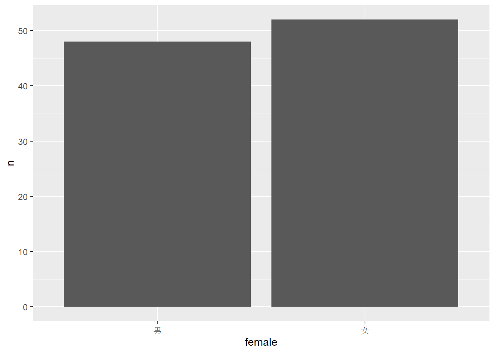

-   畫長條圖呈現男女分別百分比

```{r eval=FALSE}
ggplot(d_female, aes(x = female, y = pct)) +
  geom_col() +
  scale_y_continuous(
    name = "Percent",
    labels = scales::percent)
```

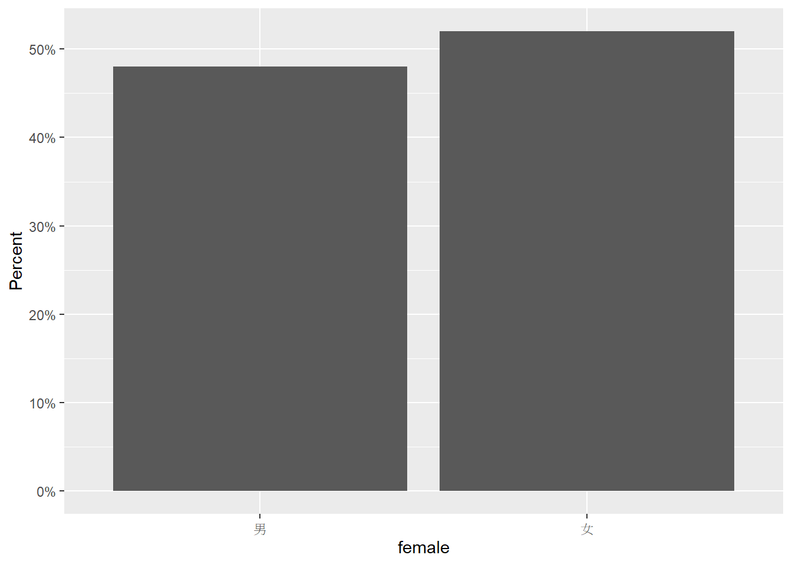

可以看到男性的樣本為48筆、佔約48%，女性的樣本稍多一點為52筆、佔約52%。

### 單一數值變項

以bmi為例，呈現**描述統計**

描述統計

-   使用summary函數

```{r}
summary(R_use_analysis[["bmi"]])
```

-   若只想看平均數也可以直接指定mean

```{r}
R_use_analysis |>
  summarize(mean = mean(bmi))
```

接著也可以用**直方圖、折線圖或盒形圖**先來呈現(以下僅為簡單粗略呈現，若要美化則須再調整)

-   直方圖呈現

```{r eval=FALSE}
ggplot(R_use_analysis, aes(x = bmi)) +
  geom_histogram() ## geom_histogram()是直方圖
```

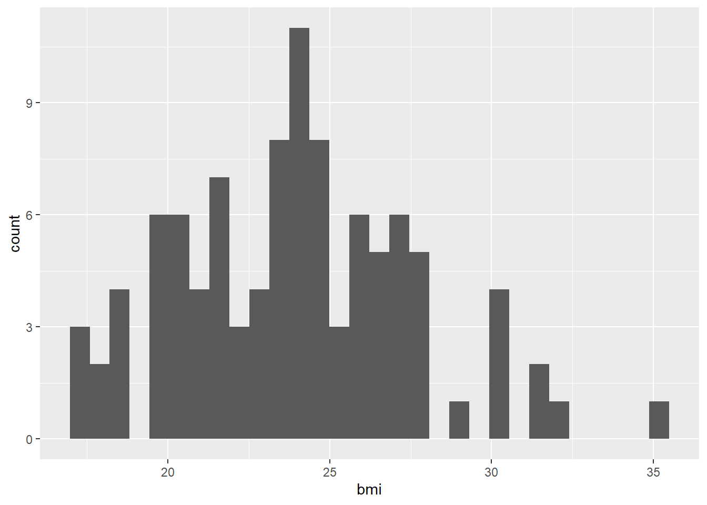

-   折線圖呈現

```{r eval=FALSE}
ggplot(R_use_analysis, aes(x = bmi)) +
  geom_freqpoly(bins = 30) ## geom_histogram()是折線圖
```

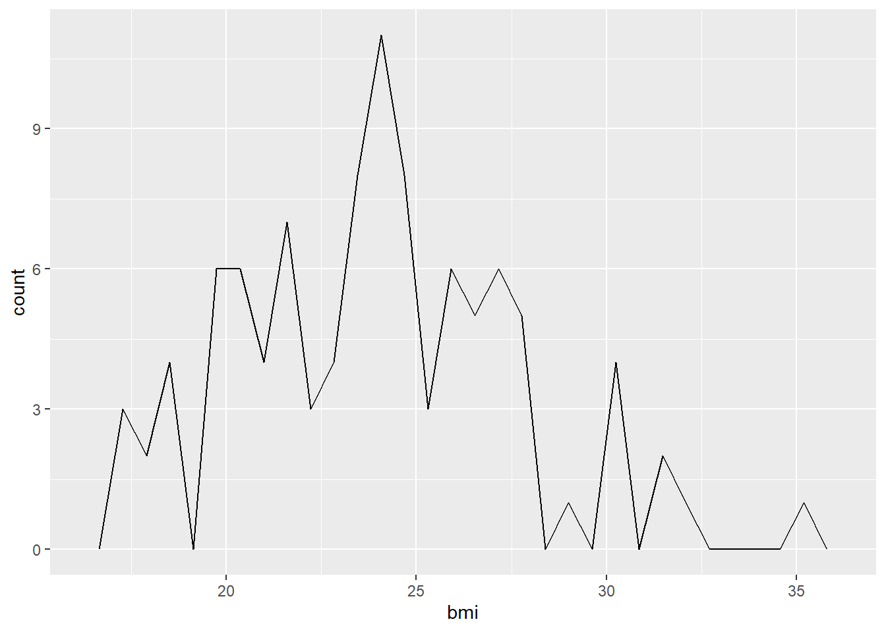

-   盒形圖呈現

```{r eval=FALSE}
ggplot(R_use_analysis, aes(x = "", y = bmi)) +
  geom_boxplot() + ## geom_boxplot()是折線圖
  labs(x = "")
```

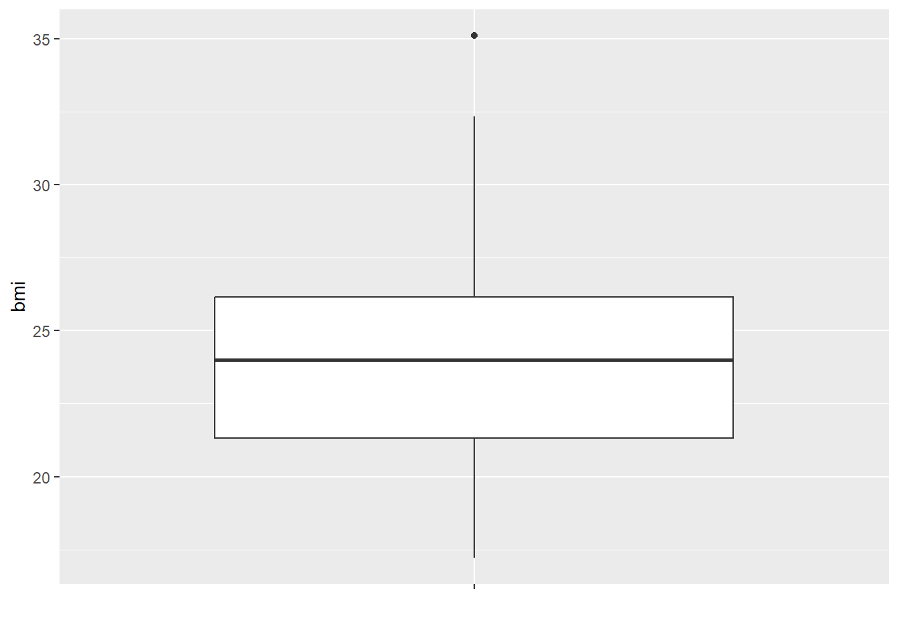

可以看到平均bmi約落在23.94左右，最小為17.21、最大為35.11。

### 兩個類別變項

查看性別(female)與塑身意願(fitness)的分布，做成**交叉表**的方式呈現

交叉表

-   用計算方式

```{r}
d_female <- R_use_analysis |>
  count(female, fitness) |>
  group_by(female) |> ## 以female做分組
  mutate(pct = n / sum(n)) |>
  ungroup()

d_female
```

-   使用`table()`函數

```{r}
with(R_use_analysis, table(
  female, fitness
))
```

-   使用`CrossTable()`函數

```{r}
with(R_use_analysis, gmodels::CrossTable(
  female, fitness
))
```

接著也可以用**堆疊長條圖、並列長條圖**先來呈現(以下僅為簡單粗略呈現，若要美化則須再調整)

-   並列長條圖

```{r eval=FALSE}
ggplot(d_female, aes(
  x = fitness, fill = female, y = pct)) + 
  geom_col(position = "dodge") ## "dodge" 指定堆疊並列
```

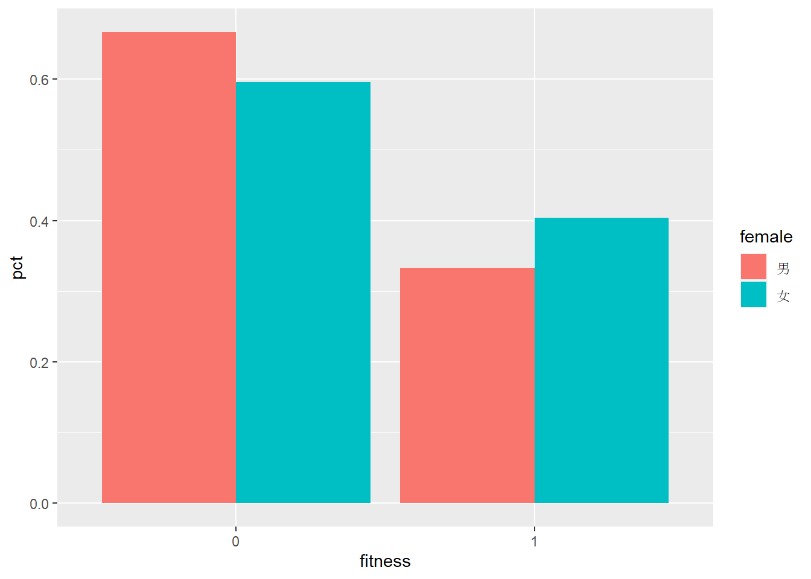

-   堆疊長條圖

```{r eval=FALSE}
ggplot(d_female, aes(
  x = fitness, fill = female, y = n)) +
  geom_col(position = "stack") ## "stack" 指定堆疊
```

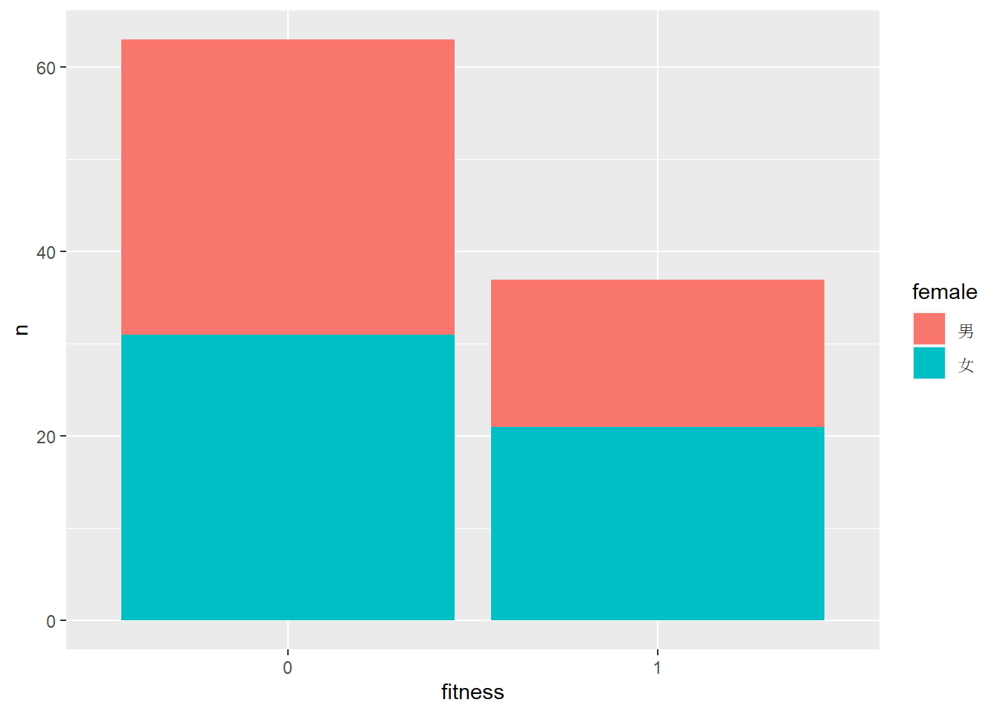

可以看到整體而言，男性平均有66.7%沒有塑身意願、33.3%有塑身意願，女性平均有59.6%沒有塑身意願、40.4%有塑身意願，女性相較於男性稍微有多一點的塑身意願。


### 兩個數值變項

查看年齡(age)和bmi的影響關係，計算兩者**相關係數**

-   使用`cor()`函數，呈現相關係數

```{r}
R_use_analysis |>
  summarize(cor = cor(age, bmi, use="complete.obs"))
```

兩者的相關係數約為0.23，算是低度正相關

接著也可以用**散布圖、並加上預測線**先來呈現(以下僅為簡單粗略呈現，若要美化則須再調整)

-   散布圖

```{r eval=FALSE}
ggplot(R_use_analysis, aes(x = age, y = bmi)) +
  geom_point() ## geom_point()是散布圖
```

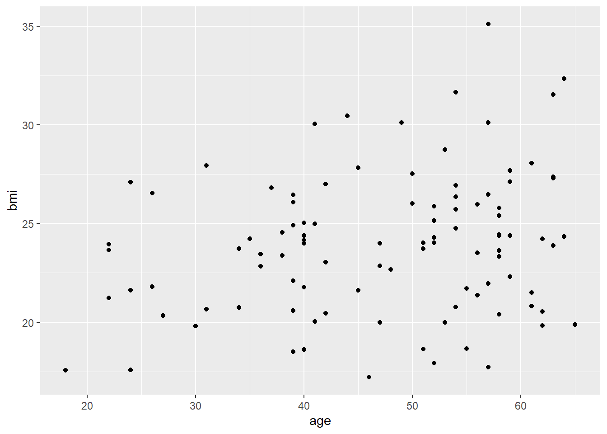

-   加上預測線

```{r eval=FALSE}
ggplot(R_use_analysis, aes(x = age, y = bmi)) +
  geom_point() +
  geom_smooth(method = "glm")
```

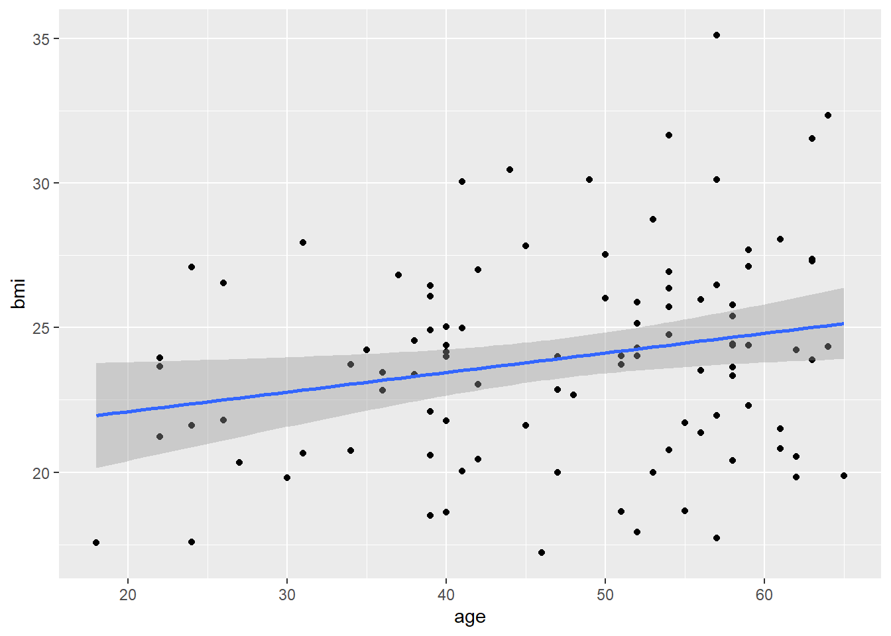

### 一個類別一個數值變項

查看不同性別(female)的bmi差異

分組描述統計

```{r}
R_use_analysis |>
  group_by(female) |> ## 以female做分組
  summarize(mean = mean(bmi))
```

接著也可以用**分組盒形圖、分組折線圖線**先來呈現(以下僅為簡單粗略呈現，若要美化則須再調整)

-   分組盒形圖

```{r eval=FALSE}
ggplot(R_use_analysis, aes(
  x = female, y = bmi)) +
  geom_boxplot()
```

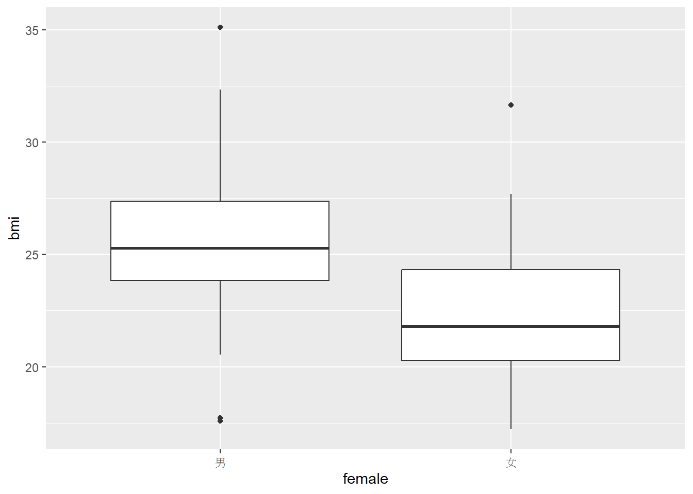

-   分組折線圖

```{r eval=FALSE}
ggplot(R_use_analysis, aes(
  x = bmi,
  color = female)) +
  geom_freqpoly()
```

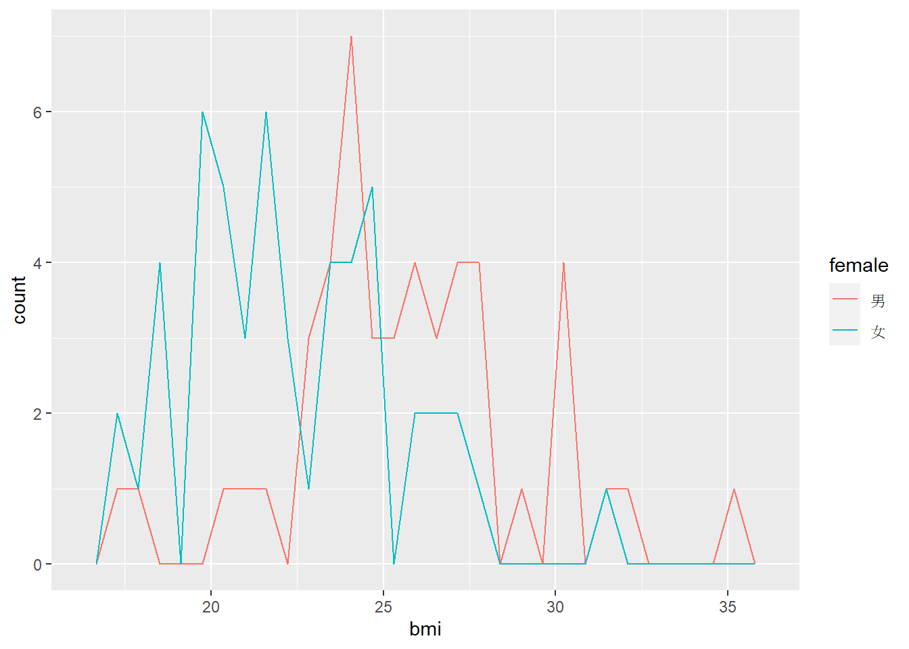

可以看到男性的bmi平均為25.63，女性的bmi平均為22.37，男性的bmi略大於女性。

### 兩個數值變項用類別變項分組

查看不同性別(female)，如何影響對於年齡(age)對於bmi的影響

分組相關係數

```{r}
R_use_analysis |>
  group_by(female) |> ## 以female做分組
  summarize(cor = cor(age, bmi, use="complete.obs"))
```

接著也可以用**按照性別分組呈現散布圖、並加上預測線**先來呈現(以下僅為簡單粗略呈現，若要美化則須再調整)

-   分組散布圖

```{r eval=FALSE}
ggplot(R_use_analysis, aes(x = age, y = bmi)) +
  geom_point() +
  facet_wrap(~ female) ## 按照性別分組
```

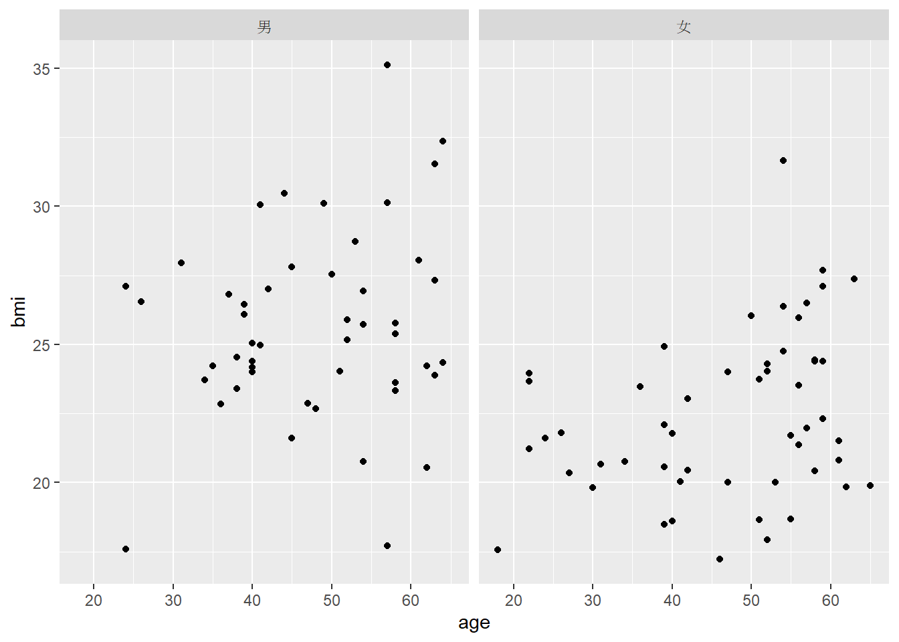

-   加上預測線

```{r eval=FALSE}
ggplot(R_use_analysis, aes(x = age, y = bmi)) +
  geom_point() +
  geom_smooth(method = "glm") +
  facet_wrap(~ female) ## 按照性別分組
```

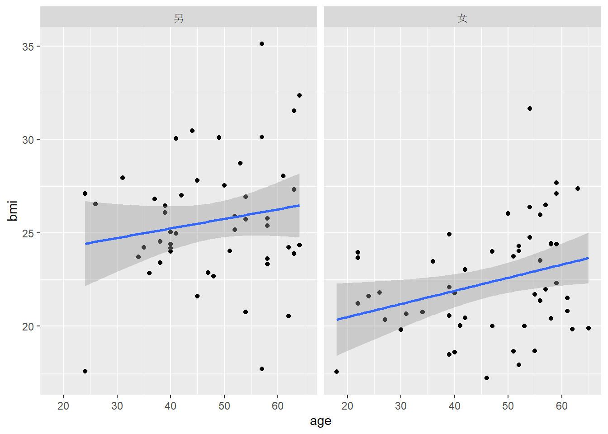

可以看到不管性別為何，年齡和bmi之間的關係都是低度的正相關，但女性(0.30)的影響似乎比男性(0.16)來的大。

### 其他進階統計

前面章節呈現了初步探索性資料分析，讓我們可以簡單了解各個變項簡單的分布資訊，但若是要進一步去探討變項間的關係，可能還會需要做其他的統計檢定，這邊就涉及到了其他進階相關的統計知識與分析技巧，這份講義並不會特別提到，R語言在統計方法上也提供非常多相關套件，另外R語言也有提供資料探勘、機器學習...其他進階探索、處理與分析資料的相關的方法，如果有興趣者可以再去參考相關進階講義。
